<!-- GENERATED:MODEL -->
---
tags: [odoo, community, generated, model]
---

# barcode.rule

- Module: [[docs/Community Addons/barcodes_gs1_nomenclature/barcodes_gs1_nomenclature|barcodes_gs1_nomenclature]]
- Scope: Community Addons
- Defined in module: extension only
- Source files: `models/barcode_rule.py`
- Python classes: `BarcodeRule`

## Field footprint

- Detected fields: 6
- Field types: `Boolean` x 2, `Many2one` x 1, `Selection` x 3
- Relation fields: 1

## Sample fields

- `associated_uom_id`: `Many2one` (comodel `uom.uom`)
- `encoding`: `Selection`
- `gs1_content_type`: `Selection`
- `gs1_decimal_usage`: `Boolean` (comodel `Decimal`)
- `is_gs1_nomenclature`: `Boolean` (related `barcode_nomenclature_id.is_gs1_nomenclature`)
- `type`: `Selection`

## Method hints

- Detected methods: 2
- Action methods: none
- Compute methods: none
- Onchange methods: none

## Direct relation diagram

```plantuml
@startuml
!define ODOO_COLOR_PRIMARY #714B67
!define ODOO_COLOR_ACCENT #875A7B
!define ODOO_COLOR_BG #FAF7FA

skinparam backgroundColor ODOO_COLOR_BG
skinparam defaultTextAlignment left
skinparam ArrowColor ODOO_COLOR_ACCENT
skinparam ClassBackgroundColor white
skinparam ClassBorderColor ODOO_COLOR_PRIMARY
skinparam ComponentBackgroundColor white
skinparam ComponentBorderColor ODOO_COLOR_PRIMARY
skinparam NoteBackgroundColor #FFF8FF
skinparam NoteBorderColor ODOO_COLOR_ACCENT
skinparam SequenceLifeLineBorderColor ODOO_COLOR_ACCENT
skinparam SequenceLifeLineBackgroundColor #FFFFFF
skinparam SequenceParticipantBorderColor ODOO_COLOR_PRIMARY
skinparam SequenceParticipantBackgroundColor #FFFFFF
skinparam sequence {
  ArrowColor ODOO_COLOR_ACCENT
  ActorBorderColor ODOO_COLOR_PRIMARY
}
title barcode.rule - Direct Relations
class "barcode.rule" as barcode_rule
class "uom.uom" as uom_uom
barcode_rule --> uom_uom : associated_uom_id
@enduml
```

## Navigation

- **Parent:** [[docs/Community Addons/barcodes_gs1_nomenclature/Models]]

<!-- GENERATED:MODEL -->
