<!-- GENERATED:MODEL -->
---
tags: [odoo, community, generated, model]
---

# res.city

- Module: [[docs/Community Addons/base_address_extended/base_address_extended|base_address_extended]]
- Scope: Community Addons
- Defined in module: yes
- Source files: `models/res_city.py`
- Python classes: `ResCity`
- Description: City

## Field footprint

- Detected fields: 4
- Field types: `Char` x 2, `Many2one` x 2
- Relation fields: 2

## Sample fields

- `country_id`: `Many2one` (comodel `res.country`)
- `name`: `Char` (comodel `Name`)
- `state_id`: `Many2one` (comodel `res.country.state`)
- `zipcode`: `Char` (comodel `Zip`)

## Method hints

- Detected methods: 1
- Action methods: none
- Compute methods: `_compute_display_name`
- Onchange methods: none

## Direct relation diagram

```plantuml
@startuml
!define ODOO_COLOR_PRIMARY #714B67
!define ODOO_COLOR_ACCENT #875A7B
!define ODOO_COLOR_BG #FAF7FA

skinparam backgroundColor ODOO_COLOR_BG
skinparam defaultTextAlignment left
skinparam ArrowColor ODOO_COLOR_ACCENT
skinparam ClassBackgroundColor white
skinparam ClassBorderColor ODOO_COLOR_PRIMARY
skinparam ComponentBackgroundColor white
skinparam ComponentBorderColor ODOO_COLOR_PRIMARY
skinparam NoteBackgroundColor #FFF8FF
skinparam NoteBorderColor ODOO_COLOR_ACCENT
skinparam SequenceLifeLineBorderColor ODOO_COLOR_ACCENT
skinparam SequenceLifeLineBackgroundColor #FFFFFF
skinparam SequenceParticipantBorderColor ODOO_COLOR_PRIMARY
skinparam SequenceParticipantBackgroundColor #FFFFFF
skinparam sequence {
  ArrowColor ODOO_COLOR_ACCENT
  ActorBorderColor ODOO_COLOR_PRIMARY
}
title res.city - Direct Relations
class "res.city" as res_city
class "res.country" as res_country
class "res.country.state" as res_country_state
res_city --> res_country : country_id
res_city --> res_country_state : state_id
@enduml
```

## Navigation

- **Parent:** [[docs/Community Addons/base_address_extended/Models]]

<!-- GENERATED:MODEL -->
