<!-- GENERATED:MODEL -->
---
tags: [odoo, community, generated, model]
---

# res.partner

- Module: [[docs/Community Addons/base_address_extended/base_address_extended|base_address_extended]]
- Scope: Community Addons
- Defined in module: extension only
- Source files: `models/res_partner.py`
- Python classes: `ResPartner`

## Field footprint

- Detected fields: 5
- Field types: `Boolean` x 1, `Char` x 3, `Many2one` x 1
- Relation fields: 1

## Sample fields

- `city_id`: `Many2one` (comodel `res.city`)
- `country_enforce_cities`: `Boolean` (related `country_id.enforce_cities`)
- `street_name`: `Char` (comodel `Street Name`, compute `_compute_street_data`, store `True`)
- `street_number`: `Char` (comodel `House`, compute `_compute_street_data`, store `True`)
- `street_number2`: `Char` (comodel `Door`, compute `_compute_street_data`, store `True`)

## Method hints

- Detected methods: 6
- Action methods: none
- Compute methods: `_compute_street_data`
- Onchange methods: `_onchange_city_id`, `_onchange_country_id`

## Direct relation diagram

```plantuml
@startuml
!define ODOO_COLOR_PRIMARY #714B67
!define ODOO_COLOR_ACCENT #875A7B
!define ODOO_COLOR_BG #FAF7FA

skinparam backgroundColor ODOO_COLOR_BG
skinparam defaultTextAlignment left
skinparam ArrowColor ODOO_COLOR_ACCENT
skinparam ClassBackgroundColor white
skinparam ClassBorderColor ODOO_COLOR_PRIMARY
skinparam ComponentBackgroundColor white
skinparam ComponentBorderColor ODOO_COLOR_PRIMARY
skinparam NoteBackgroundColor #FFF8FF
skinparam NoteBorderColor ODOO_COLOR_ACCENT
skinparam SequenceLifeLineBorderColor ODOO_COLOR_ACCENT
skinparam SequenceLifeLineBackgroundColor #FFFFFF
skinparam SequenceParticipantBorderColor ODOO_COLOR_PRIMARY
skinparam SequenceParticipantBackgroundColor #FFFFFF
skinparam sequence {
  ArrowColor ODOO_COLOR_ACCENT
  ActorBorderColor ODOO_COLOR_PRIMARY
}
title res.partner - Direct Relations
class "res.partner" as res_partner
class "res.city" as res_city
res_partner --> res_city : city_id
@enduml
```

## Navigation

- **Parent:** [[docs/Community Addons/base_address_extended/Models]]

<!-- GENERATED:MODEL -->
