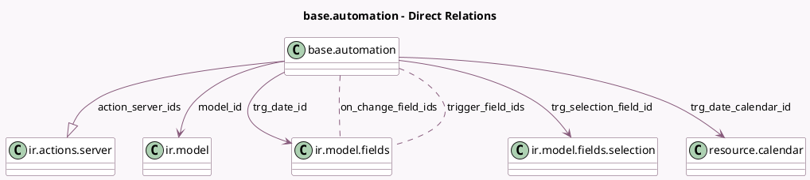

<!-- GENERATED:MODEL -->
---
tags: [odoo, community, generated, model]
---

# base.automation

- Module: [[docs/Community Addons/base_automation/base_automation|base_automation]]
- Scope: Community Addons
- Defined in module: yes
- Source files: `models/base_automation.py`
- Python classes: `BaseAutomation`
- Description: Automation Rule
- Inherits: `mail.activity.mixin`, `mail.thread`

## Field footprint

- Detected fields: 26
- Field types: `Boolean` x 3, `Char` x 9, `Datetime` x 1, `Html` x 1, `Integer` x 1, `Many2many` x 2, `Many2one` x 4, `Many2oneReference` x 1, `One2many` x 1, `Selection` x 3
- Relation fields: 7

## Sample fields

- `action_server_ids`: `One2many` (comodel `ir.actions.server`, compute `_compute_action_server_ids`, store `True`)
- `active`: `Boolean`
- `description`: `Html`
- `filter_domain`: `Char` (compute `_compute_filter_domain`, store `True`)
- `filter_pre_domain`: `Char` (compute `_compute_filter_pre_domain`, store `True`)
- `last_run`: `Datetime`
- `log_webhook_calls`: `Boolean`
- `model_id`: `Many2one` (comodel `ir.model`)
- `model_is_mail_thread`: `Boolean` (related `model_id.is_mail_thread`)
- `model_name`: `Char` (related `model_id.model`)
- `name`: `Char`
- `on_change_field_ids`: `Many2many` (comodel `ir.model.fields`, compute `_compute_on_change_field_ids`, store `True`)
- `previous_domain`: `Char` (store `False`)
- `record_getter`: `Char`
- `trg_date_calendar_id`: `Many2one` (comodel `resource.calendar`, compute `_compute_trg_date_calendar_id`, store `True`)
- `trg_date_id`: `Many2one` (comodel `ir.model.fields`, compute `_compute_trg_date_id`, store `True`)
- `trg_date_range`: `Integer` (compute `_compute_trg_date_range_data`, store `True`)
- `trg_date_range_mode`: `Selection` (compute `_compute_trg_date_range_data`, store `True`)
- `trg_date_range_type`: `Selection` (compute `_compute_trg_date_range_data`, store `True`)
- `trg_field_ref`: `Many2oneReference` (compute `_compute_trg_field_ref`, store `True`)

## Method hints

- Detected methods: 50
- Action methods: `action_open_scheduled_action`, `action_rotate_webhook_uuid`, `action_view_webhook_logs`
- Compute methods: `_compute_action_server_ids`, `_compute_filter_domain`, `_compute_filter_pre_domain`, `_compute_on_change_field_ids`, `_compute_trg_date_calendar_id`, `_compute_trg_date_id`, `_compute_trg_date_range_data`, `_compute_trg_field_ref`, and 5 more
- Onchange methods: `_onchange_domain`, `_onchange_trg_date_range_data`, `_onchange_trigger`, `_onchange_trigger_or_actions`

## Direct relation diagram

## Navigation

- **Parent:** [[docs/Community Addons/base_automation/Models]]

<!-- GENERATED:MODEL -->
