<!-- GENERATED:MODEL -->
---
tags: [odoo, community, generated, model]
---

# ir.actions.server

- Module: [[docs/Community Addons/base_automation/base_automation|base_automation]]
- Scope: Community Addons
- Defined in module: extension only
- Source files: `models/ir_actions_server.py`
- Python classes: `IrActionsServer`

## Field footprint

- Detected fields: 2
- Field types: `Many2one` x 1, `Selection` x 1
- Relation fields: 1

## Sample fields

- `base_automation_id`: `Many2one` (comodel `base.automation`)
- `usage`: `Selection`

## Method hints

- Detected methods: 6
- Action methods: `action_open_automation`
- Compute methods: `_compute_available_model_ids`
- Onchange methods: none

## Direct relation diagram

```plantuml
@startuml
!define ODOO_COLOR_PRIMARY #714B67
!define ODOO_COLOR_ACCENT #875A7B
!define ODOO_COLOR_BG #FAF7FA

skinparam backgroundColor ODOO_COLOR_BG
skinparam defaultTextAlignment left
skinparam ArrowColor ODOO_COLOR_ACCENT
skinparam ClassBackgroundColor white
skinparam ClassBorderColor ODOO_COLOR_PRIMARY
skinparam ComponentBackgroundColor white
skinparam ComponentBorderColor ODOO_COLOR_PRIMARY
skinparam NoteBackgroundColor #FFF8FF
skinparam NoteBorderColor ODOO_COLOR_ACCENT
skinparam SequenceLifeLineBorderColor ODOO_COLOR_ACCENT
skinparam SequenceLifeLineBackgroundColor #FFFFFF
skinparam SequenceParticipantBorderColor ODOO_COLOR_PRIMARY
skinparam SequenceParticipantBackgroundColor #FFFFFF
skinparam sequence {
  ArrowColor ODOO_COLOR_ACCENT
  ActorBorderColor ODOO_COLOR_PRIMARY
}
title ir.actions.server - Direct Relations
class "ir.actions.server" as ir_actions_server
class "base.automation" as base_automation
ir_actions_server --> base_automation : base_automation_id
@enduml
```

## Navigation

- **Parent:** [[docs/Community Addons/base_automation/Models]]

<!-- GENERATED:MODEL -->
