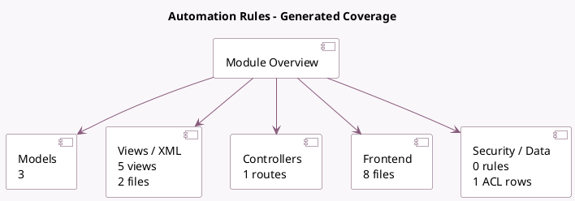

<!-- GENERATED:MODULE -->
---
tags: [odoo, community, module]
---

# Automation Rules

- Scope: Community Addons
- Source: odoo/addons/base_automation
- Dependencies: base (not documented), [[docs/Community Addons/digest/digest|digest]], [[docs/Community Addons/resource/resource|resource]], [[docs/Community Addons/mail/mail|mail]], [[docs/Community Addons/sms/sms|sms]]

## Generated coverage

- Models: 3
- XML files with UI/data artifacts: 2
- Views: 5
- Actions: 1
- Menus: 1
- Rules (ir.rule): 0
- Access CSV entries: 1
- Controller units: 1
- Frontend asset files: 8

## Module map

## Detail notes

- Models: [[docs/Community Addons/base_automation/Models|Models]] (3)
- Views and XML: [[docs/Community Addons/base_automation/Views|Views]] (2 files)
- Controllers: [[docs/Community Addons/base_automation/Controllers|Controllers]] (1)
- Frontend: [[docs/Community Addons/base_automation/Frontend|Frontend]] (8 files)

## Key models

- `base.automation`
- `ir.actions.server`
- `ir.cron`

## Navigation

- [[../Community Addons/Community Addons|Back to scope]]
- [[../../docs/docs|Back to docs]]

<!-- GENERATED:MODULE -->

