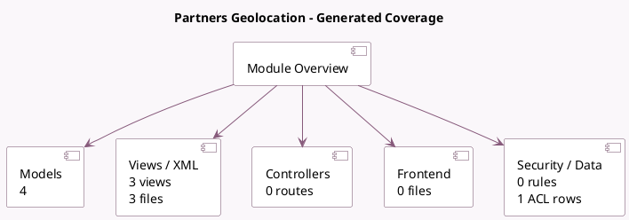

<!-- GENERATED:MODULE -->
---
tags: [odoo, community, module]
---

# Partners Geolocation

- Scope: Community Addons
- Source: odoo/addons/base_geolocalize
- Dependencies: [[docs/Community Addons/base_setup/base_setup|base_setup]]

## Generated coverage

- Models: 4
- XML files with UI/data artifacts: 3
- Views: 3
- Actions: 0
- Menus: 0
- Rules (ir.rule): 0
- Access CSV entries: 1
- Controller units: 0
- Frontend asset files: 0

## Module map

## Detail notes

- Models: [[docs/Community Addons/base_geolocalize/Models|Models]] (4)
- Views and XML: [[docs/Community Addons/base_geolocalize/Views|Views]] (3 files)

## Key models

- `base.geo_provider`
- `base.geocoder`
- `res.config.settings`
- `res.partner`

## Navigation

- [[../Community Addons/Community Addons|Back to scope]]
- [[../../docs/docs|Back to docs]]

<!-- GENERATED:MODULE -->

