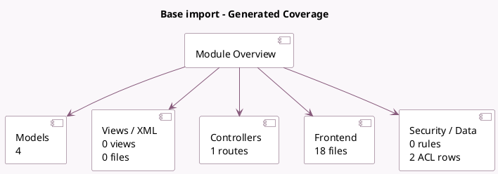

<!-- GENERATED:MODULE -->
---
tags: [odoo, community, module]
---

# Base import

- Scope: Community Addons
- Source: odoo/addons/base_import
- Dependencies: [[docs/Community Addons/web/web|web]]

## Generated coverage

- Models: 4
- XML files with UI/data artifacts: 0
- Views: 0
- Actions: 0
- Menus: 0
- Rules (ir.rule): 0
- Access CSV entries: 2
- Controller units: 1
- Frontend asset files: 18

## Module map

## Detail notes

- Models: [[docs/Community Addons/base_import/Models|Models]] (4)
- Controllers: [[docs/Community Addons/base_import/Controllers|Controllers]] (1)
- Frontend: [[docs/Community Addons/base_import/Frontend|Frontend]] (18 files)

## Key models

- `base`
- `base_import.import`
- `base_import.mapping`
- `res.users`

## Navigation

- [[../Community Addons/Community Addons|Back to scope]]
- [[../../docs/docs|Back to docs]]

<!-- GENERATED:MODULE -->

