<!-- GENERATED:MODEL -->
---
tags: [odoo, community, generated, model]
---

# base.module.install.request

- Module: [[docs/Community Addons/base_install_request/base_install_request|base_install_request]]
- Scope: Community Addons
- Defined in module: yes
- Source files: `wizard/base_module_install_request.py`
- Python classes: `BaseModuleInstallRequest`
- Description: Module Activation Request

## Field footprint

- Detected fields: 4
- Field types: `Html` x 1, `Many2many` x 1, `Many2one` x 2
- Relation fields: 3

## Sample fields

- `body_html`: `Html` (comodel `Body`)
- `module_id`: `Many2one` (comodel `ir.module.module`)
- `user_id`: `Many2one` (comodel `res.users`)
- `user_ids`: `Many2many` (comodel `res.users`, compute `_compute_user_ids`)

## Method hints

- Detected methods: 2
- Action methods: `action_send_request`
- Compute methods: `_compute_user_ids`
- Onchange methods: none

## Direct relation diagram

```plantuml
@startuml
!define ODOO_COLOR_PRIMARY #714B67
!define ODOO_COLOR_ACCENT #875A7B
!define ODOO_COLOR_BG #FAF7FA

skinparam backgroundColor ODOO_COLOR_BG
skinparam defaultTextAlignment left
skinparam ArrowColor ODOO_COLOR_ACCENT
skinparam ClassBackgroundColor white
skinparam ClassBorderColor ODOO_COLOR_PRIMARY
skinparam ComponentBackgroundColor white
skinparam ComponentBorderColor ODOO_COLOR_PRIMARY
skinparam NoteBackgroundColor #FFF8FF
skinparam NoteBorderColor ODOO_COLOR_ACCENT
skinparam SequenceLifeLineBorderColor ODOO_COLOR_ACCENT
skinparam SequenceLifeLineBackgroundColor #FFFFFF
skinparam SequenceParticipantBorderColor ODOO_COLOR_PRIMARY
skinparam SequenceParticipantBackgroundColor #FFFFFF
skinparam sequence {
  ArrowColor ODOO_COLOR_ACCENT
  ActorBorderColor ODOO_COLOR_PRIMARY
}
title base.module.install.request - Direct Relations
class "base.module.install.request" as base_module_install_request
class "ir.module.module" as ir_module_module
class "res.users" as res_users
base_module_install_request --> ir_module_module : module_id
base_module_install_request --> res_users : user_id
base_module_install_request .. res_users : user_ids
@enduml
```

## Navigation

- **Parent:** [[docs/Community Addons/base_install_request/Models]]

<!-- GENERATED:MODEL -->
