<!-- GENERATED:MODEL -->
---
tags: [odoo, community, generated, model]
---

# res.config.settings

- Module: [[docs/Community Addons/base_setup/base_setup|base_setup]]
- Scope: Community Addons
- Defined in module: extension only
- Source files: `models/res_config_settings.py`
- Python classes: `ResConfigSettings`

## Field footprint

- Detected fields: 29
- Field types: `Boolean` x 18, `Char` x 2, `Datetime` x 1, `Html` x 1, `Integer` x 3, `Json` x 1, `Many2one` x 2, `Text` x 1
- Relation fields: 2

## Sample fields

- `active_user_count`: `Integer` (comodel `Number of Active Users`, compute `_compute_active_user_count`)
- `company_count`: `Integer` (comodel `Number of Companies`, compute `_compute_company_count`)
- `company_country_code`: `Char` (related `company_id.country_id.code`)
- `company_country_group_codes`: `Json` (related `company_id.country_id.country_group_codes`)
- `company_id`: `Many2one` (comodel `res.company`)
- `company_informations`: `Text` (compute `_compute_company_informations`)
- `company_name`: `Char` (related `company_id.display_name`)
- `external_report_layout_id`: `Many2one` (related `company_id.external_report_layout_id`)
- `group_multi_currency`: `Boolean`
- `is_root_company`: `Boolean` (compute `_compute_is_root_company`)
- `language_count`: `Integer` (comodel `Number of Languages`, compute `_compute_language_count`)
- `module_account_inter_company_rules`: `Boolean` (comodel `Manage Inter Company`)
- `module_auth_ldap`: `Boolean` (comodel `LDAP Authentication`)
- `module_auth_oauth`: `Boolean` (comodel `Use external authentication providers (OAuth)`)
- `module_base_geolocalize`: `Boolean` (comodel `GeoLocalize`)
- `module_base_import`: `Boolean` (comodel `Allow users to import data from CSV/XLS/XLSX/ODS files`)
- `module_google_address_autocomplete`: `Boolean` (comodel `Google Address Autocomplete`)
- `module_google_calendar`: `Boolean`
- `module_google_recaptcha`: `Boolean` (comodel `reCAPTCHA`)
- `module_mail_plugin`: `Boolean`

## Method hints

- Detected methods: 9
- Action methods: none
- Compute methods: `_compute_active_user_count`, `_compute_company_count`, `_compute_company_informations`, `_compute_is_root_company`, `_compute_language_count`
- Onchange methods: none

## Direct relation diagram

```plantuml
@startuml
!define ODOO_COLOR_PRIMARY #714B67
!define ODOO_COLOR_ACCENT #875A7B
!define ODOO_COLOR_BG #FAF7FA

skinparam backgroundColor ODOO_COLOR_BG
skinparam defaultTextAlignment left
skinparam ArrowColor ODOO_COLOR_ACCENT
skinparam ClassBackgroundColor white
skinparam ClassBorderColor ODOO_COLOR_PRIMARY
skinparam ComponentBackgroundColor white
skinparam ComponentBorderColor ODOO_COLOR_PRIMARY
skinparam NoteBackgroundColor #FFF8FF
skinparam NoteBorderColor ODOO_COLOR_ACCENT
skinparam SequenceLifeLineBorderColor ODOO_COLOR_ACCENT
skinparam SequenceLifeLineBackgroundColor #FFFFFF
skinparam SequenceParticipantBorderColor ODOO_COLOR_PRIMARY
skinparam SequenceParticipantBackgroundColor #FFFFFF
skinparam sequence {
  ArrowColor ODOO_COLOR_ACCENT
  ActorBorderColor ODOO_COLOR_PRIMARY
}
title res.config.settings - Direct Relations
class "res.config.settings" as res_config_settings
class "res.company" as res_company
res_config_settings --> res_company : company_id
@enduml
```

## Navigation

- **Parent:** [[docs/Community Addons/base_setup/Models]]

<!-- GENERATED:MODEL -->
