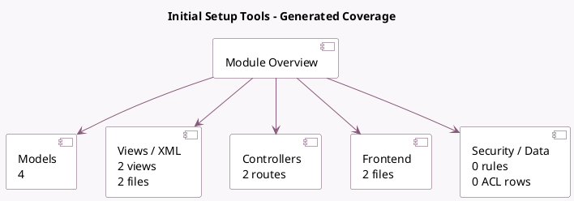

<!-- GENERATED:MODULE -->
---
tags: [odoo, community, module]
---

# Initial Setup Tools

- Scope: Community Addons
- Source: odoo/addons/base_setup
- Dependencies: base (not documented), [[docs/Community Addons/web/web|web]]

## Generated coverage

- Models: 4
- XML files with UI/data artifacts: 2
- Views: 2
- Actions: 1
- Menus: 1
- Rules (ir.rule): 0
- Access CSV entries: 0
- Controller units: 1
- Frontend asset files: 2

## Module map

## Detail notes

- Models: [[docs/Community Addons/base_setup/Models|Models]] (4)
- Views and XML: [[docs/Community Addons/base_setup/Views|Views]] (2 files)
- Controllers: [[docs/Community Addons/base_setup/Controllers|Controllers]] (1)
- Frontend: [[docs/Community Addons/base_setup/Frontend|Frontend]] (2 files)

## Key models

- `ir.http`
- `kpi.provider`
- `res.config.settings`
- `res.users`

## Navigation

- [[../Community Addons/Community Addons|Back to scope]]
- [[../../docs/docs|Back to docs]]

<!-- GENERATED:MODULE -->

