<!-- GENERATED:MODEL -->
---
tags: [odoo, community, generated, model]
---

# sparse_fields.test

- Module: [[docs/Community Addons/base_sparse_field/base_sparse_field|base_sparse_field]]
- Scope: Community Addons
- Defined in module: yes
- Source files: `models/models.py`
- Python classes: `Sparse_FieldsTest`
- Description: Sparse fields Test

## Field footprint

- Detected fields: 7
- Field types: `Boolean` x 1, `Char` x 1, `Float` x 1, `Integer` x 1, `Many2one` x 1, `Selection` x 1, `Serialized` x 1
- Relation fields: 1

## Sample fields

- `boolean`: `Boolean`
- `char`: `Char`
- `data`: `Serialized`
- `float`: `Float`
- `integer`: `Integer`
- `partner`: `Many2one` (comodel `res.partner`)
- `selection`: `Selection`

## Method hints

- Detected methods: 0
- Action methods: none
- Compute methods: none
- Onchange methods: none

## Direct relation diagram

```plantuml
@startuml
!define ODOO_COLOR_PRIMARY #714B67
!define ODOO_COLOR_ACCENT #875A7B
!define ODOO_COLOR_BG #FAF7FA

skinparam backgroundColor ODOO_COLOR_BG
skinparam defaultTextAlignment left
skinparam ArrowColor ODOO_COLOR_ACCENT
skinparam ClassBackgroundColor white
skinparam ClassBorderColor ODOO_COLOR_PRIMARY
skinparam ComponentBackgroundColor white
skinparam ComponentBorderColor ODOO_COLOR_PRIMARY
skinparam NoteBackgroundColor #FFF8FF
skinparam NoteBorderColor ODOO_COLOR_ACCENT
skinparam SequenceLifeLineBorderColor ODOO_COLOR_ACCENT
skinparam SequenceLifeLineBackgroundColor #FFFFFF
skinparam SequenceParticipantBorderColor ODOO_COLOR_PRIMARY
skinparam SequenceParticipantBackgroundColor #FFFFFF
skinparam sequence {
  ArrowColor ODOO_COLOR_ACCENT
  ActorBorderColor ODOO_COLOR_PRIMARY
}
title sparse_fields.test - Direct Relations
class "sparse_fields.test" as sparse_fields_test
class "res.partner" as res_partner
sparse_fields_test --> res_partner : partner
@enduml
```

## Navigation

- **Parent:** [[docs/Community Addons/base_sparse_field/Models]]

<!-- GENERATED:MODEL -->
