<!-- GENERATED:MODEL -->
---
tags: [odoo, community, generated, model]
---

# res.partner

- Module: [[docs/Community Addons/base_vat/base_vat|base_vat]]
- Scope: Community Addons
- Defined in module: extension only
- Source files: `models/res_partner.py`
- Python classes: `ResPartner`

## Field footprint

- Detected fields: 4
- Field types: `Boolean` x 2, `Char` x 1, `Many2one` x 1
- Relation fields: 1

## Sample fields

- `country_id`: `Many2one` (store `True`)
- `perform_vies_validation`: `Boolean` (compute `_compute_perform_vies_validation`)
- `vat`: `Char` (store `True`)
- `vies_valid`: `Boolean` (compute `_compute_vies_valid`, store `True`)

## Method hints

- Detected methods: 50
- Action methods: none
- Compute methods: `_compute_perform_vies_validation`, `_compute_vies_valid`
- Onchange methods: `_onchange_vat`

## Direct relation diagram

```plantuml
@startuml
!define ODOO_COLOR_PRIMARY #714B67
!define ODOO_COLOR_ACCENT #875A7B
!define ODOO_COLOR_BG #FAF7FA

skinparam backgroundColor ODOO_COLOR_BG
skinparam defaultTextAlignment left
skinparam ArrowColor ODOO_COLOR_ACCENT
skinparam ClassBackgroundColor white
skinparam ClassBorderColor ODOO_COLOR_PRIMARY
skinparam ComponentBackgroundColor white
skinparam ComponentBorderColor ODOO_COLOR_PRIMARY
skinparam NoteBackgroundColor #FFF8FF
skinparam NoteBorderColor ODOO_COLOR_ACCENT
skinparam SequenceLifeLineBorderColor ODOO_COLOR_ACCENT
skinparam SequenceLifeLineBackgroundColor #FFFFFF
skinparam SequenceParticipantBorderColor ODOO_COLOR_PRIMARY
skinparam SequenceParticipantBackgroundColor #FFFFFF
skinparam sequence {
  ArrowColor ODOO_COLOR_ACCENT
  ActorBorderColor ODOO_COLOR_PRIMARY
}
title res.partner - Direct Relations
class "res.partner" as res_partner
@enduml
```

## Navigation

- **Parent:** [[docs/Community Addons/base_vat/Models]]

<!-- GENERATED:MODEL -->
