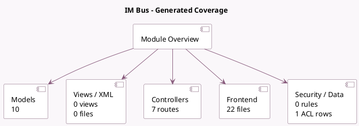

<!-- GENERATED:MODULE -->
---
tags: [odoo, community, module]
---

# IM Bus

- Scope: Community Addons
- Source: odoo/addons/bus
- Dependencies: base (not documented), [[docs/Community Addons/web/web|web]]

## Generated coverage

- Models: 10
- XML files with UI/data artifacts: 0
- Views: 0
- Actions: 0
- Menus: 0
- Rules (ir.rule): 0
- Access CSV entries: 1
- Controller units: 2
- Frontend asset files: 22

## Module map

## Detail notes

- Models: [[docs/Community Addons/bus/Models|Models]] (10)
- Controllers: [[docs/Community Addons/bus/Controllers|Controllers]] (2)
- Frontend: [[docs/Community Addons/bus/Frontend|Frontend]] (22 files)

## Key models

- `bus.bus`
- `bus.listener.mixin`
- `ir.attachment`
- `ir.http`
- `ir.model`
- `ir.websocket`
- `res.groups`
- `res.partner`
- `res.users`
- `res.users.settings`

## Navigation

- [[../Community Addons/Community Addons|Back to scope]]
- [[../../docs/docs|Back to docs]]

<!-- GENERATED:MODULE -->

