<!-- GENERATED:MODEL -->
---
tags: [odoo, community, generated, model]
---

# calendar.alarm

- Module: [[docs/Community Addons/calendar/calendar|calendar]]
- Scope: Community Addons
- Defined in module: yes
- Source files: `models/calendar_alarm.py`
- Python classes: `CalendarAlarm`
- Description: Event Alarm

## Field footprint

- Detected fields: 8
- Field types: `Boolean` x 1, `Char` x 1, `Integer` x 2, `Many2one` x 1, `Selection` x 2, `Text` x 1
- Relation fields: 1

## Sample fields

- `alarm_type`: `Selection`
- `body`: `Text` (comodel `Additional Message`)
- `duration`: `Integer` (comodel `Remind Before`)
- `duration_minutes`: `Integer` (comodel `Duration in minutes`, compute `_compute_duration_minutes`, store `True`)
- `interval`: `Selection`
- `mail_template_id`: `Many2one` (comodel `mail.template`, compute `_compute_mail_template_id`, store `True`)
- `name`: `Char` (comodel `Name`)
- `notify_responsible`: `Boolean` (comodel `Notify Responsible`)

## Method hints

- Detected methods: 4
- Action methods: none
- Compute methods: `_compute_duration_minutes`, `_compute_mail_template_id`
- Onchange methods: `_onchange_duration_interval`

## Direct relation diagram

```plantuml
@startuml
!define ODOO_COLOR_PRIMARY #714B67
!define ODOO_COLOR_ACCENT #875A7B
!define ODOO_COLOR_BG #FAF7FA

skinparam backgroundColor ODOO_COLOR_BG
skinparam defaultTextAlignment left
skinparam ArrowColor ODOO_COLOR_ACCENT
skinparam ClassBackgroundColor white
skinparam ClassBorderColor ODOO_COLOR_PRIMARY
skinparam ComponentBackgroundColor white
skinparam ComponentBorderColor ODOO_COLOR_PRIMARY
skinparam NoteBackgroundColor #FFF8FF
skinparam NoteBorderColor ODOO_COLOR_ACCENT
skinparam SequenceLifeLineBorderColor ODOO_COLOR_ACCENT
skinparam SequenceLifeLineBackgroundColor #FFFFFF
skinparam SequenceParticipantBorderColor ODOO_COLOR_PRIMARY
skinparam SequenceParticipantBackgroundColor #FFFFFF
skinparam sequence {
  ArrowColor ODOO_COLOR_ACCENT
  ActorBorderColor ODOO_COLOR_PRIMARY
}
title calendar.alarm - Direct Relations
class "calendar.alarm" as calendar_alarm
class "mail.template" as mail_template
calendar_alarm --> mail_template : mail_template_id
@enduml
```

## Navigation

- **Parent:** [[docs/Community Addons/calendar/Models]]

<!-- GENERATED:MODEL -->
