<!-- GENERATED:MODEL -->
---
tags: [odoo, community, generated, model]
---

# calendar.attendee

- Module: [[docs/Community Addons/calendar/calendar|calendar]]
- Scope: Community Addons
- Defined in module: yes
- Source files: `models/calendar_attendee.py`
- Python classes: `CalendarAttendee`
- Description: Calendar Attendee Information

## Field footprint

- Detected fields: 10
- Field types: `Char` x 4, `Many2one` x 3, `Selection` x 3
- Relation fields: 3

## Sample fields

- `access_token`: `Char` (comodel `Invitation Token`)
- `availability`: `Selection`
- `common_name`: `Char` (comodel `Common name`, compute `_compute_common_name`, store `True`)
- `email`: `Char` (comodel `Email`, related `partner_id.email`)
- `event_id`: `Many2one` (comodel `calendar.event`)
- `mail_tz`: `Selection` (compute `_compute_mail_tz`)
- `partner_id`: `Many2one` (comodel `res.partner`)
- `phone`: `Char` (comodel `Phone`, related `partner_id.phone`)
- `recurrence_id`: `Many2one` (comodel `calendar.recurrence`, related `event_id.recurrence_id`)
- `state`: `Selection`

## Method hints

- Detected methods: 15
- Action methods: none
- Compute methods: `_compute_common_name`, `_compute_mail_tz`
- Onchange methods: none

## Direct relation diagram

```plantuml
@startuml
!define ODOO_COLOR_PRIMARY #714B67
!define ODOO_COLOR_ACCENT #875A7B
!define ODOO_COLOR_BG #FAF7FA

skinparam backgroundColor ODOO_COLOR_BG
skinparam defaultTextAlignment left
skinparam ArrowColor ODOO_COLOR_ACCENT
skinparam ClassBackgroundColor white
skinparam ClassBorderColor ODOO_COLOR_PRIMARY
skinparam ComponentBackgroundColor white
skinparam ComponentBorderColor ODOO_COLOR_PRIMARY
skinparam NoteBackgroundColor #FFF8FF
skinparam NoteBorderColor ODOO_COLOR_ACCENT
skinparam SequenceLifeLineBorderColor ODOO_COLOR_ACCENT
skinparam SequenceLifeLineBackgroundColor #FFFFFF
skinparam SequenceParticipantBorderColor ODOO_COLOR_PRIMARY
skinparam SequenceParticipantBackgroundColor #FFFFFF
skinparam sequence {
  ArrowColor ODOO_COLOR_ACCENT
  ActorBorderColor ODOO_COLOR_PRIMARY
}
title calendar.attendee - Direct Relations
class "calendar.attendee" as calendar_attendee
class "calendar.event" as calendar_event
class "calendar.recurrence" as calendar_recurrence
class "res.partner" as res_partner
calendar_attendee --> calendar_event : event_id
calendar_attendee --> calendar_recurrence : recurrence_id
calendar_attendee --> res_partner : partner_id
@enduml
```

## Navigation

- **Parent:** [[docs/Community Addons/calendar/Models]]

<!-- GENERATED:MODEL -->
