<!-- GENERATED:MODEL -->
---
tags: [odoo, community, generated, model]
---

# calendar.event

- Module: [[docs/Community Addons/calendar/calendar|calendar]]
- Scope: Community Addons
- Defined in module: yes
- Source files: `models/calendar_event.py`
- Python classes: `CalendarEvent`
- Description: Calendar Event
- Inherits: `mail.thread`

## Field footprint

- Detected fields: 67
- Field types: `Boolean` x 16, `Char` x 8, `Date` x 3, `Datetime` x 2, `Float` x 1, `Html` x 2, `Integer` x 8, `Many2many` x 5, `Many2one` x 6, `Many2oneReference` x 1, `One2many` x 2, `Selection` x 13
- Relation fields: 13

## Sample fields

- `accepted_count`: `Integer` (compute `_compute_attendees_count`)
- `access_token`: `Char` (comodel `Invitation Token`, store `True`)
- `active`: `Boolean` (comodel `Active`)
- `activity_ids`: `One2many` (comodel `mail.activity`)
- `alarm_ids`: `Many2many` (comodel `calendar.alarm`)
- `allday`: `Boolean` (comodel `All Day`)
- `attendee_ids`: `One2many` (comodel `calendar.attendee`)
- `attendees_count`: `Integer` (compute `_compute_attendees_count`)
- `awaiting_count`: `Integer` (compute `_compute_attendees_count`)
- `byday`: `Selection` (compute `_compute_recurrence`)
- `categ_ids`: `Many2many` (comodel `calendar.event.type`)
- `count`: `Integer` (compute `_compute_recurrence`)
- `current_attendee`: `Many2one` (comodel `calendar.attendee`, compute `_compute_current_attendee`)
- `current_status`: `Selection` (related `current_attendee.state`)
- `day`: `Integer` (comodel `Date of month`, compute `_compute_recurrence`)
- `declined_count`: `Integer` (compute `_compute_attendees_count`)
- `description`: `Html` (comodel `Description`)
- `display_description`: `Boolean` (compute `_compute_display_description`)
- `display_time`: `Char` (comodel `Event Time`, compute `_compute_display_time`)
- `duration`: `Float` (comodel `Duration`, compute `_compute_duration`, store `True`)

## Method hints

- Detected methods: 99
- Action methods: `action_join_meeting`, `action_join_video_call`, `action_mass_archive`, `action_mass_deletion`, `action_open_calendar_event`, `action_open_composer`, `action_sendmail`, `action_unlink_event`
- Compute methods: `_compute_attendees_count`, `_compute_current_attendee`, `_compute_dates`, `_compute_display_description`, `_compute_display_name`, `_compute_display_time`, `_compute_duration`, `_compute_effective_privacy`, and 12 more
- Onchange methods: `_onchange_date`

## Direct relation diagram

```plantuml
@startuml
!define ODOO_COLOR_PRIMARY #714B67
!define ODOO_COLOR_ACCENT #875A7B
!define ODOO_COLOR_BG #FAF7FA

skinparam backgroundColor ODOO_COLOR_BG
skinparam defaultTextAlignment left
skinparam ArrowColor ODOO_COLOR_ACCENT
skinparam ClassBackgroundColor white
skinparam ClassBorderColor ODOO_COLOR_PRIMARY
skinparam ComponentBackgroundColor white
skinparam ComponentBorderColor ODOO_COLOR_PRIMARY
skinparam NoteBackgroundColor #FFF8FF
skinparam NoteBorderColor ODOO_COLOR_ACCENT
skinparam SequenceLifeLineBorderColor ODOO_COLOR_ACCENT
skinparam SequenceLifeLineBackgroundColor #FFFFFF
skinparam SequenceParticipantBorderColor ODOO_COLOR_PRIMARY
skinparam SequenceParticipantBackgroundColor #FFFFFF
skinparam sequence {
  ArrowColor ODOO_COLOR_ACCENT
  ActorBorderColor ODOO_COLOR_PRIMARY
}
title calendar.event - Direct Relations
class "calendar.event" as calendar_event
class "calendar.alarm" as calendar_alarm
class "calendar.attendee" as calendar_attendee
class "calendar.event.type" as calendar_event_type
class "calendar.recurrence" as calendar_recurrence
class "discuss.channel" as discuss_channel
class "ir.model" as ir_model
class "mail.activity" as mail_activity
class "res.partner" as res_partner
class "res.users" as res_users
calendar_event --> res_users : user_id
calendar_event --> res_partner : partner_id
calendar_event --> discuss_channel : videocall_channel_id
calendar_event .. calendar_event_type : categ_ids
calendar_event --> ir_model : res_model_id
calendar_event --|> mail_activity : activity_ids
calendar_event --|> calendar_attendee : attendee_ids
calendar_event --> calendar_attendee : current_attendee
calendar_event .. res_partner : partner_ids
calendar_event .. res_partner : invalid_email_partner_ids
calendar_event .. res_partner : unavailable_partner_ids
calendar_event .. calendar_alarm : alarm_ids
calendar_event --> calendar_recurrence : recurrence_id
@enduml
```

## Navigation

- **Parent:** [[docs/Community Addons/calendar/Models]]

<!-- GENERATED:MODEL -->
