<!-- GENERATED:MODEL -->
---
tags: [odoo, community, generated, model]
---

# calendar.filters

- Module: [[docs/Community Addons/calendar/calendar|calendar]]
- Scope: Community Addons
- Defined in module: yes
- Source files: `models/calendar_filter.py`
- Python classes: `CalendarFilters`
- Description: Calendar Filters

## Field footprint

- Detected fields: 4
- Field types: `Boolean` x 2, `Many2one` x 2
- Relation fields: 2

## Sample fields

- `active`: `Boolean` (comodel `Active`)
- `partner_checked`: `Boolean` (comodel `Checked`)
- `partner_id`: `Many2one` (comodel `res.partner`)
- `user_id`: `Many2one` (comodel `res.users`)

## Method hints

- Detected methods: 1
- Action methods: none
- Compute methods: none
- Onchange methods: none

## Direct relation diagram

```plantuml
@startuml
!define ODOO_COLOR_PRIMARY #714B67
!define ODOO_COLOR_ACCENT #875A7B
!define ODOO_COLOR_BG #FAF7FA

skinparam backgroundColor ODOO_COLOR_BG
skinparam defaultTextAlignment left
skinparam ArrowColor ODOO_COLOR_ACCENT
skinparam ClassBackgroundColor white
skinparam ClassBorderColor ODOO_COLOR_PRIMARY
skinparam ComponentBackgroundColor white
skinparam ComponentBorderColor ODOO_COLOR_PRIMARY
skinparam NoteBackgroundColor #FFF8FF
skinparam NoteBorderColor ODOO_COLOR_ACCENT
skinparam SequenceLifeLineBorderColor ODOO_COLOR_ACCENT
skinparam SequenceLifeLineBackgroundColor #FFFFFF
skinparam SequenceParticipantBorderColor ODOO_COLOR_PRIMARY
skinparam SequenceParticipantBackgroundColor #FFFFFF
skinparam sequence {
  ArrowColor ODOO_COLOR_ACCENT
  ActorBorderColor ODOO_COLOR_PRIMARY
}
title calendar.filters - Direct Relations
class "calendar.filters" as calendar_filters
class "res.partner" as res_partner
class "res.users" as res_users
calendar_filters --> res_users : user_id
calendar_filters --> res_partner : partner_id
@enduml
```

## Navigation

- **Parent:** [[docs/Community Addons/calendar/Models]]

<!-- GENERATED:MODEL -->
