<!-- GENERATED:MODEL -->
---
tags: [odoo, community, generated, model]
---

# calendar.popover.delete.wizard

- Module: [[docs/Community Addons/calendar/calendar|calendar]]
- Scope: Community Addons
- Defined in module: yes
- Source files: `wizard/calendar_popover_delete_wizard.py`
- Python classes: `CalendarPopoverDeleteWizard`
- Description: Calendar Popover Delete Wizard
- Inherits: `mail.composer.mixin`

## Field footprint

- Detected fields: 3
- Field types: `Many2many` x 1, `Many2one` x 1, `Selection` x 1
- Relation fields: 2

## Sample fields

- `calendar_event_id`: `Many2one` (comodel `calendar.event`)
- `delete`: `Selection`
- `recipient_ids`: `Many2many` (comodel `res.partner`, compute `_compute_recipient_ids`)

## Method hints

- Detected methods: 6
- Action methods: `action_delete`, `action_send_mail_and_delete`
- Compute methods: `_compute_body`, `_compute_recipient_ids`, `_compute_subject`
- Onchange methods: none

## Direct relation diagram

```plantuml
@startuml
!define ODOO_COLOR_PRIMARY #714B67
!define ODOO_COLOR_ACCENT #875A7B
!define ODOO_COLOR_BG #FAF7FA

skinparam backgroundColor ODOO_COLOR_BG
skinparam defaultTextAlignment left
skinparam ArrowColor ODOO_COLOR_ACCENT
skinparam ClassBackgroundColor white
skinparam ClassBorderColor ODOO_COLOR_PRIMARY
skinparam ComponentBackgroundColor white
skinparam ComponentBorderColor ODOO_COLOR_PRIMARY
skinparam NoteBackgroundColor #FFF8FF
skinparam NoteBorderColor ODOO_COLOR_ACCENT
skinparam SequenceLifeLineBorderColor ODOO_COLOR_ACCENT
skinparam SequenceLifeLineBackgroundColor #FFFFFF
skinparam SequenceParticipantBorderColor ODOO_COLOR_PRIMARY
skinparam SequenceParticipantBackgroundColor #FFFFFF
skinparam sequence {
  ArrowColor ODOO_COLOR_ACCENT
  ActorBorderColor ODOO_COLOR_PRIMARY
}
title calendar.popover.delete.wizard - Direct Relations
class "calendar.popover.delete.wizard" as calendar_popover_delete_wizard
class "calendar.event" as calendar_event
class "res.partner" as res_partner
calendar_popover_delete_wizard --> calendar_event : calendar_event_id
calendar_popover_delete_wizard .. res_partner : recipient_ids
@enduml
```

## Navigation

- **Parent:** [[docs/Community Addons/calendar/Models]]

<!-- GENERATED:MODEL -->
