<!-- GENERATED:MODEL -->
---
tags: [odoo, community, generated, model]
---

# calendar.recurrence

- Module: [[docs/Community Addons/calendar/calendar|calendar]]
- Scope: Community Addons
- Defined in module: yes
- Source files: `models/calendar_recurrence.py`
- Python classes: `CalendarRecurrence`
- Description: Event Recurrence Rule

## Field footprint

- Detected fields: 23
- Field types: `Boolean` x 7, `Char` x 2, `Date` x 1, `Datetime` x 1, `Integer` x 3, `Many2one` x 2, `One2many` x 1, `Selection` x 6
- Relation fields: 3

## Sample fields

- `base_event_id`: `Many2one` (comodel `calendar.event`)
- `byday`: `Selection`
- `calendar_event_ids`: `One2many` (comodel `calendar.event`)
- `count`: `Integer`
- `day`: `Integer`
- `dtstart`: `Datetime` (compute `_compute_dtstart`)
- `end_type`: `Selection`
- `event_tz`: `Selection`
- `fri`: `Boolean`
- `interval`: `Integer`
- `mon`: `Boolean`
- `month_by`: `Selection`
- `name`: `Char` (compute `_compute_name`, store `True`)
- `rrule`: `Char` (compute `_compute_rrule`, store `True`)
- `rrule_type`: `Selection`
- `sat`: `Boolean`
- `sun`: `Boolean`
- `thu`: `Boolean`
- `trigger_id`: `Many2one` (comodel `ir.cron.trigger`)
- `tue`: `Boolean`

## Method hints

- Detected methods: 32
- Action methods: none
- Compute methods: `_compute_dtstart`, `_compute_name`, `_compute_rrule`
- Onchange methods: none

## Direct relation diagram

```plantuml
@startuml
!define ODOO_COLOR_PRIMARY #714B67
!define ODOO_COLOR_ACCENT #875A7B
!define ODOO_COLOR_BG #FAF7FA

skinparam backgroundColor ODOO_COLOR_BG
skinparam defaultTextAlignment left
skinparam ArrowColor ODOO_COLOR_ACCENT
skinparam ClassBackgroundColor white
skinparam ClassBorderColor ODOO_COLOR_PRIMARY
skinparam ComponentBackgroundColor white
skinparam ComponentBorderColor ODOO_COLOR_PRIMARY
skinparam NoteBackgroundColor #FFF8FF
skinparam NoteBorderColor ODOO_COLOR_ACCENT
skinparam SequenceLifeLineBorderColor ODOO_COLOR_ACCENT
skinparam SequenceLifeLineBackgroundColor #FFFFFF
skinparam SequenceParticipantBorderColor ODOO_COLOR_PRIMARY
skinparam SequenceParticipantBackgroundColor #FFFFFF
skinparam sequence {
  ArrowColor ODOO_COLOR_ACCENT
  ActorBorderColor ODOO_COLOR_PRIMARY
}
title calendar.recurrence - Direct Relations
class "calendar.recurrence" as calendar_recurrence
class "calendar.event" as calendar_event
class "ir.cron.trigger" as ir_cron_trigger
calendar_recurrence --> calendar_event : base_event_id
calendar_recurrence --|> calendar_event : calendar_event_ids
calendar_recurrence --> ir_cron_trigger : trigger_id
@enduml
```

## Navigation

- **Parent:** [[docs/Community Addons/calendar/Models]]

<!-- GENERATED:MODEL -->
