<!-- GENERATED:MODEL -->
---
tags: [odoo, community, generated, model]
---

# mail.activity.mixin

- Module: [[docs/Community Addons/calendar/calendar|calendar]]
- Scope: Community Addons
- Defined in module: extension only
- Source files: `models/mail_activity_mixin.py`
- Python classes: `MailActivityMixin`

## Field footprint

- Detected fields: 1
- Field types: `Many2one` x 1
- Relation fields: 1

## Sample fields

- `activity_calendar_event_id`: `Many2one` (comodel `calendar.event`, compute `_compute_activity_calendar_event_id`)

## Method hints

- Detected methods: 1
- Action methods: none
- Compute methods: `_compute_activity_calendar_event_id`
- Onchange methods: none

## Direct relation diagram

```plantuml
@startuml
!define ODOO_COLOR_PRIMARY #714B67
!define ODOO_COLOR_ACCENT #875A7B
!define ODOO_COLOR_BG #FAF7FA

skinparam backgroundColor ODOO_COLOR_BG
skinparam defaultTextAlignment left
skinparam ArrowColor ODOO_COLOR_ACCENT
skinparam ClassBackgroundColor white
skinparam ClassBorderColor ODOO_COLOR_PRIMARY
skinparam ComponentBackgroundColor white
skinparam ComponentBorderColor ODOO_COLOR_PRIMARY
skinparam NoteBackgroundColor #FFF8FF
skinparam NoteBorderColor ODOO_COLOR_ACCENT
skinparam SequenceLifeLineBorderColor ODOO_COLOR_ACCENT
skinparam SequenceLifeLineBackgroundColor #FFFFFF
skinparam SequenceParticipantBorderColor ODOO_COLOR_PRIMARY
skinparam SequenceParticipantBackgroundColor #FFFFFF
skinparam sequence {
  ArrowColor ODOO_COLOR_ACCENT
  ActorBorderColor ODOO_COLOR_PRIMARY
}
title mail.activity.mixin - Direct Relations
class "mail.activity.mixin" as mail_activity_mixin
class "calendar.event" as calendar_event
mail_activity_mixin --> calendar_event : activity_calendar_event_id
@enduml
```

## Navigation

- **Parent:** [[docs/Community Addons/calendar/Models]]

<!-- GENERATED:MODEL -->
