<!-- GENERATED:MODEL -->
---
tags: [odoo, community, generated, model]
---

# res.partner

- Module: [[docs/Community Addons/calendar/calendar|calendar]]
- Scope: Community Addons
- Defined in module: extension only
- Source files: `models/res_partner.py`
- Python classes: `ResPartner`

## Field footprint

- Detected fields: 3
- Field types: `Datetime` x 1, `Integer` x 1, `Many2many` x 1
- Relation fields: 1

## Sample fields

- `calendar_last_notif_ack`: `Datetime` (comodel `Last notification marked as read from base Calendar`)
- `meeting_count`: `Integer` (comodel `# Meetings`, compute `_compute_meeting_count`)
- `meeting_ids`: `Many2many` (comodel `calendar.event`)

## Method hints

- Detected methods: 7
- Action methods: none
- Compute methods: `_compute_application_statistics_hook`, `_compute_meeting`, `_compute_meeting_count`
- Onchange methods: none

## Direct relation diagram

```plantuml
@startuml
!define ODOO_COLOR_PRIMARY #714B67
!define ODOO_COLOR_ACCENT #875A7B
!define ODOO_COLOR_BG #FAF7FA

skinparam backgroundColor ODOO_COLOR_BG
skinparam defaultTextAlignment left
skinparam ArrowColor ODOO_COLOR_ACCENT
skinparam ClassBackgroundColor white
skinparam ClassBorderColor ODOO_COLOR_PRIMARY
skinparam ComponentBackgroundColor white
skinparam ComponentBorderColor ODOO_COLOR_PRIMARY
skinparam NoteBackgroundColor #FFF8FF
skinparam NoteBorderColor ODOO_COLOR_ACCENT
skinparam SequenceLifeLineBorderColor ODOO_COLOR_ACCENT
skinparam SequenceLifeLineBackgroundColor #FFFFFF
skinparam SequenceParticipantBorderColor ODOO_COLOR_PRIMARY
skinparam SequenceParticipantBackgroundColor #FFFFFF
skinparam sequence {
  ArrowColor ODOO_COLOR_ACCENT
  ActorBorderColor ODOO_COLOR_PRIMARY
}
title res.partner - Direct Relations
class "res.partner" as res_partner
class "calendar.event" as calendar_event
res_partner .. calendar_event : meeting_ids
@enduml
```

## Navigation

- **Parent:** [[docs/Community Addons/calendar/Models]]

<!-- GENERATED:MODEL -->
