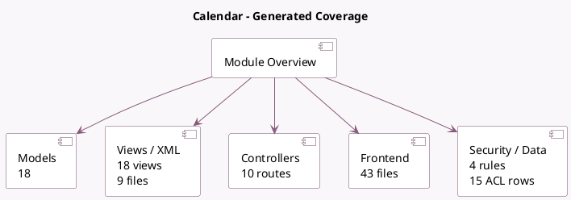

<!-- GENERATED:MODULE -->
---
tags: [odoo, community, module]
---

# Calendar

- Scope: Community Addons
- Source: odoo/addons/calendar
- Dependencies: base (not documented), [[docs/Community Addons/mail/mail|mail]]

## Summary

Schedule employees' meetings

## Generated coverage

- Models: 18
- XML files with UI/data artifacts: 9
- Views: 18
- Actions: 8
- Menus: 8
- Rules (ir.rule): 4
- Access CSV entries: 15
- Controller units: 1
- Frontend asset files: 43

## Module map

## Detail notes

- Models: [[docs/Community Addons/calendar/Models|Models]] (18)
- Views and XML: [[docs/Community Addons/calendar/Views|Views]] (9 files)
- Controllers: [[docs/Community Addons/calendar/Controllers|Controllers]] (1)
- Frontend: [[docs/Community Addons/calendar/Frontend|Frontend]] (43 files)

## Key models

- `calendar.alarm`
- `calendar.alarm_manager`
- `calendar.attendee`
- `calendar.event`
- `calendar.event.type`
- `calendar.filters`
- `calendar.popover.delete.wizard`
- `calendar.provider.config`
- `calendar.recurrence`
- `discuss.channel`
- `ir.http`
- `mail.activity`

## Navigation

- [[../Community Addons/Community Addons|Back to scope]]
- [[../../docs/docs|Back to docs]]

<!-- GENERATED:MODULE -->

