<!-- GENERATED:MODEL -->
---
tags: [odoo, community, generated, model]
---

# certificate.key

- Module: [[docs/Community Addons/certificate/certificate|certificate]]
- Scope: Community Addons
- Defined in module: yes
- Source files: `models/key.py`
- Python classes: `CertificateKey`
- Description: Cryptographic Keys

## Field footprint

- Detected fields: 8
- Field types: `Binary` x 2, `Boolean` x 2, `Char` x 2, `Many2one` x 1, `Text` x 1
- Relation fields: 1

## Sample fields

- `active`: `Boolean`
- `company_id`: `Many2one` (comodel `res.company`)
- `content`: `Binary`
- `loading_error`: `Text` (compute `_compute_pem_key`, store `True`)
- `name`: `Char`
- `password`: `Char`
- `pem_key`: `Binary` (compute `_compute_pem_key`, store `True`)
- `public`: `Boolean` (compute `_compute_pem_key`, store `True`)

## Method hints

- Detected methods: 12
- Action methods: none
- Compute methods: `_compute_pem_key`
- Onchange methods: none

## Direct relation diagram

```plantuml
@startuml
!define ODOO_COLOR_PRIMARY #714B67
!define ODOO_COLOR_ACCENT #875A7B
!define ODOO_COLOR_BG #FAF7FA

skinparam backgroundColor ODOO_COLOR_BG
skinparam defaultTextAlignment left
skinparam ArrowColor ODOO_COLOR_ACCENT
skinparam ClassBackgroundColor white
skinparam ClassBorderColor ODOO_COLOR_PRIMARY
skinparam ComponentBackgroundColor white
skinparam ComponentBorderColor ODOO_COLOR_PRIMARY
skinparam NoteBackgroundColor #FFF8FF
skinparam NoteBorderColor ODOO_COLOR_ACCENT
skinparam SequenceLifeLineBorderColor ODOO_COLOR_ACCENT
skinparam SequenceLifeLineBackgroundColor #FFFFFF
skinparam SequenceParticipantBorderColor ODOO_COLOR_PRIMARY
skinparam SequenceParticipantBackgroundColor #FFFFFF
skinparam sequence {
  ArrowColor ODOO_COLOR_ACCENT
  ActorBorderColor ODOO_COLOR_PRIMARY
}
title certificate.key - Direct Relations
class "certificate.key" as certificate_key
class "res.company" as res_company
certificate_key --> res_company : company_id
@enduml
```

## Navigation

- **Parent:** [[docs/Community Addons/certificate/Models]]

<!-- GENERATED:MODEL -->
