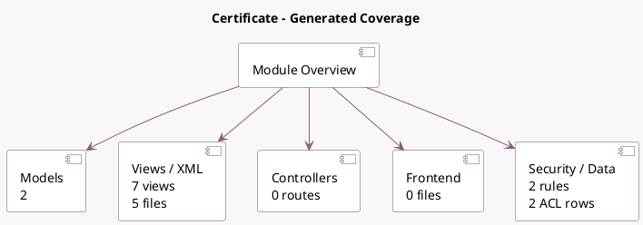

<!-- GENERATED:MODULE -->
---
tags: [odoo, community, module]
---

# Certificate

- Scope: Community Addons
- Source: odoo/addons/certificate
- Dependencies: [[docs/Community Addons/base_setup/base_setup|base_setup]]

## Summary

Manage certificate

## Generated coverage

- Models: 2
- XML files with UI/data artifacts: 5
- Views: 7
- Actions: 2
- Menus: 0
- Rules (ir.rule): 2
- Access CSV entries: 2
- Controller units: 0
- Frontend asset files: 0

## Module map

## Detail notes

- Models: [[docs/Community Addons/certificate/Models|Models]] (2)
- Views and XML: [[docs/Community Addons/certificate/Views|Views]] (5 files)

## Key models

- `certificate.certificate`
- `certificate.key`

## Navigation

- [[../Community Addons/Community Addons|Back to scope]]
- [[../../docs/docs|Back to docs]]

<!-- GENERATED:MODULE -->

