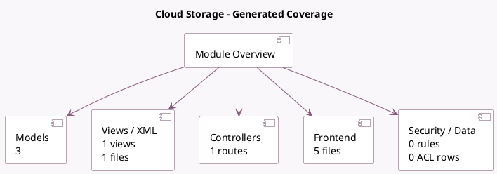

<!-- GENERATED:MODULE -->
---
tags: [odoo, community, module]
---

# Cloud Storage

- Scope: Community Addons
- Source: odoo/addons/cloud_storage
- Dependencies: [[docs/Community Addons/base_setup/base_setup|base_setup]], [[docs/Community Addons/mail/mail|mail]]

## Summary

Store chatter attachments in the cloud

## Generated coverage

- Models: 3
- XML files with UI/data artifacts: 1
- Views: 1
- Actions: 0
- Menus: 0
- Rules (ir.rule): 0
- Access CSV entries: 0
- Controller units: 1
- Frontend asset files: 5

## Module map

## Detail notes

- Models: [[docs/Community Addons/cloud_storage/Models|Models]] (3)
- Views and XML: [[docs/Community Addons/cloud_storage/Views|Views]] (1 files)
- Controllers: [[docs/Community Addons/cloud_storage/Controllers|Controllers]] (1)
- Frontend: [[docs/Community Addons/cloud_storage/Frontend|Frontend]] (5 files)

## Key models

- `ir.attachment`
- `ir.http`
- `res.config.settings`

## Navigation

- [[../Community Addons/Community Addons|Back to scope]]
- [[../../docs/docs|Back to docs]]

<!-- GENERATED:MODULE -->

