<!-- GENERATED:MODEL -->
---
tags: [odoo, community, generated, model]
---

# crm.activity.report

- Module: [[docs/Community Addons/crm/crm|crm]]
- Scope: Community Addons
- Defined in module: yes
- Source files: `report/crm_activity_report.py`
- Python classes: `CrmActivityReport`
- Description: CRM Activity Analysis

## Field footprint

- Detected fields: 20
- Field types: `Boolean` x 1, `Date` x 1, `Datetime` x 4, `Html` x 1, `Many2many` x 1, `Many2one` x 10, `Selection` x 2
- Relation fields: 11

## Sample fields

- `active`: `Boolean` (comodel `Active`)
- `author_id`: `Many2one` (comodel `res.partner`)
- `body`: `Html` (comodel `Activity Description`)
- `company_id`: `Many2one` (comodel `res.company`)
- `country_id`: `Many2one` (comodel `res.country`)
- `date`: `Datetime` (comodel `Completion Date`)
- `date_closed`: `Datetime` (comodel `Closed Date`)
- `date_conversion`: `Datetime` (comodel `Conversion Date`)
- `date_deadline`: `Date` (comodel `Expected Closing`)
- `lead_create_date`: `Datetime` (comodel `Creation Date`)
- `lead_id`: `Many2one` (comodel `crm.lead`)
- `lead_type`: `Selection`
- `mail_activity_type_id`: `Many2one` (comodel `mail.activity.type`)
- `partner_id`: `Many2one` (comodel `res.partner`)
- `stage_id`: `Many2one` (comodel `crm.stage`)
- `subtype_id`: `Many2one` (comodel `mail.message.subtype`)
- `tag_ids`: `Many2many` (related `lead_id.tag_ids`)
- `team_id`: `Many2one` (comodel `crm.team`)
- `user_id`: `Many2one` (comodel `res.users`)
- `won_status`: `Selection`

## Method hints

- Detected methods: 5
- Action methods: none
- Compute methods: none
- Onchange methods: none

## Direct relation diagram

```plantuml
@startuml
!define ODOO_COLOR_PRIMARY #714B67
!define ODOO_COLOR_ACCENT #875A7B
!define ODOO_COLOR_BG #FAF7FA

skinparam backgroundColor ODOO_COLOR_BG
skinparam defaultTextAlignment left
skinparam ArrowColor ODOO_COLOR_ACCENT
skinparam ClassBackgroundColor white
skinparam ClassBorderColor ODOO_COLOR_PRIMARY
skinparam ComponentBackgroundColor white
skinparam ComponentBorderColor ODOO_COLOR_PRIMARY
skinparam NoteBackgroundColor #FFF8FF
skinparam NoteBorderColor ODOO_COLOR_ACCENT
skinparam SequenceLifeLineBorderColor ODOO_COLOR_ACCENT
skinparam SequenceLifeLineBackgroundColor #FFFFFF
skinparam SequenceParticipantBorderColor ODOO_COLOR_PRIMARY
skinparam SequenceParticipantBackgroundColor #FFFFFF
skinparam sequence {
  ArrowColor ODOO_COLOR_ACCENT
  ActorBorderColor ODOO_COLOR_PRIMARY
}
title crm.activity.report - Direct Relations
class "crm.activity.report" as crm_activity_report
class "crm.lead" as crm_lead
class "crm.stage" as crm_stage
class "crm.team" as crm_team
class "mail.activity.type" as mail_activity_type
class "mail.message.subtype" as mail_message_subtype
class "res.company" as res_company
class "res.country" as res_country
class "res.partner" as res_partner
class "res.users" as res_users
crm_activity_report --> res_partner : author_id
crm_activity_report --> res_users : user_id
crm_activity_report --> crm_team : team_id
crm_activity_report --> crm_lead : lead_id
crm_activity_report --> mail_message_subtype : subtype_id
crm_activity_report --> mail_activity_type : mail_activity_type_id
crm_activity_report --> res_country : country_id
crm_activity_report --> res_company : company_id
crm_activity_report --> crm_stage : stage_id
crm_activity_report --> res_partner : partner_id
@enduml
```

## Navigation

- **Parent:** [[docs/Community Addons/crm/Models]]

<!-- GENERATED:MODEL -->
