<!-- GENERATED:MODEL -->
---
tags: [odoo, community, generated, model]
---

# crm.lead.lost

- Module: [[docs/Community Addons/crm/crm|crm]]
- Scope: Community Addons
- Defined in module: yes
- Source files: `wizard/crm_lead_lost.py`
- Python classes: `CrmLeadLost`
- Description: Get Lost Reason

## Field footprint

- Detected fields: 3
- Field types: `Html` x 1, `Many2many` x 1, `Many2one` x 1
- Relation fields: 2

## Sample fields

- `lead_ids`: `Many2many` (comodel `crm.lead`)
- `lost_feedback`: `Html` (comodel `Closing Note`)
- `lost_reason_id`: `Many2one` (comodel `crm.lost.reason`)

## Method hints

- Detected methods: 1
- Action methods: `action_lost_reason_apply`
- Compute methods: none
- Onchange methods: none

## Direct relation diagram

```plantuml
@startuml
!define ODOO_COLOR_PRIMARY #714B67
!define ODOO_COLOR_ACCENT #875A7B
!define ODOO_COLOR_BG #FAF7FA

skinparam backgroundColor ODOO_COLOR_BG
skinparam defaultTextAlignment left
skinparam ArrowColor ODOO_COLOR_ACCENT
skinparam ClassBackgroundColor white
skinparam ClassBorderColor ODOO_COLOR_PRIMARY
skinparam ComponentBackgroundColor white
skinparam ComponentBorderColor ODOO_COLOR_PRIMARY
skinparam NoteBackgroundColor #FFF8FF
skinparam NoteBorderColor ODOO_COLOR_ACCENT
skinparam SequenceLifeLineBorderColor ODOO_COLOR_ACCENT
skinparam SequenceLifeLineBackgroundColor #FFFFFF
skinparam SequenceParticipantBorderColor ODOO_COLOR_PRIMARY
skinparam SequenceParticipantBackgroundColor #FFFFFF
skinparam sequence {
  ArrowColor ODOO_COLOR_ACCENT
  ActorBorderColor ODOO_COLOR_PRIMARY
}
title crm.lead.lost - Direct Relations
class "crm.lead.lost" as crm_lead_lost
class "crm.lead" as crm_lead
class "crm.lost.reason" as crm_lost_reason
crm_lead_lost .. crm_lead : lead_ids
crm_lead_lost --> crm_lost_reason : lost_reason_id
@enduml
```

## Navigation

- **Parent:** [[docs/Community Addons/crm/Models]]

<!-- GENERATED:MODEL -->
