<!-- GENERATED:MODEL -->
---
tags: [odoo, community, generated, model]
---

# crm.lead

- Module: [[docs/Community Addons/crm/crm|crm]]
- Scope: Community Addons
- Defined in module: yes
- Source files: `models/crm_lead.py`
- Python classes: `CrmLead`
- Description: Lead
- Inherits: `format.address.mixin`, `mail.activity.mixin`, `mail.thread.blacklist`, `mail.thread.cc`, `mail.thread.phone`, `mail.tracking.duration.mixin`, and 1 more

## Field footprint

- Detected fields: 70
- Field types: `Boolean` x 6, `Char` x 17, `Date` x 2, `Datetime` x 5, `Float` x 4, `Html` x 1, `Integer` x 4, `Many2many` x 3, `Many2one` x 15, `Monetary` x 6, `One2many` x 1, `Properties` x 1, `Selection` x 5
- Relation fields: 19

## Sample fields

- `active`: `Boolean` (comodel `Active`)
- `automated_probability`: `Float` (comodel `Automated Probability`, compute `_compute_probabilities`, store `True`)
- `calendar_event_ids`: `One2many` (comodel `calendar.event`)
- `campaign_id`: `Many2one`
- `city`: `Char` (comodel `City`, compute `_compute_partner_address_values`, store `True`)
- `color`: `Integer` (comodel `Color Index`)
- `commercial_partner_id`: `Many2one` (comodel `res.partner`, compute `_compute_commercial_partner_id`, store `False`)
- `company_currency`: `Many2one` (comodel `res.currency`, compute `_compute_company_currency`)
- `company_id`: `Many2one` (comodel `res.company`, compute `_compute_company_id`, store `True`)
- `contact_name`: `Char` (comodel `Contact Name`, compute `_compute_contact_name`, store `True`)
- `country_id`: `Many2one` (comodel `res.country`, compute `_compute_partner_address_values`, store `True`)
- `date_automation_last`: `Datetime` (comodel `Last Action`)
- `date_closed`: `Datetime` (comodel `Closed Date`)
- `date_conversion`: `Datetime` (comodel `Conversion Date`)
- `date_deadline`: `Date` (comodel `Expected Closing`)
- `date_last_stage_update`: `Datetime` (comodel `Last Stage Update`, compute `_compute_date_last_stage_update`, store `True`)
- `date_open`: `Datetime` (comodel `Assignment Date`, compute `_compute_date_open`, store `True`)
- `day_close`: `Float` (comodel `Days to Close`, compute `_compute_day_close`, store `True`)
- `day_open`: `Float` (comodel `Days to Assign`, compute `_compute_day_open`, store `True`)
- `description`: `Html` (comodel `Notes`)

## Method hints

- Detected methods: 119
- Action methods: `action_reschedule_meeting`, `action_restore`, `action_schedule_meeting`, `action_set_automated_probability`, `action_set_lost`, `action_set_won`, `action_set_won_rainbowman`, `action_show_potential_duplicates`, and 1 more
- Compute methods: `_compute_commercial_partner_id`, `_compute_company_currency`, `_compute_company_id`, `_compute_contact_name`, `_compute_date_last_stage_update`, `_compute_date_open`, `_compute_day_close`, `_compute_day_open`, and 27 more
- Onchange methods: `_onchange_commercial_partner_id`, `_onchange_phone_validation`

## Direct relation diagram

```plantuml
@startuml
!define ODOO_COLOR_PRIMARY #714B67
!define ODOO_COLOR_ACCENT #875A7B
!define ODOO_COLOR_BG #FAF7FA

skinparam backgroundColor ODOO_COLOR_BG
skinparam defaultTextAlignment left
skinparam ArrowColor ODOO_COLOR_ACCENT
skinparam ClassBackgroundColor white
skinparam ClassBorderColor ODOO_COLOR_PRIMARY
skinparam ComponentBackgroundColor white
skinparam ComponentBorderColor ODOO_COLOR_PRIMARY
skinparam NoteBackgroundColor #FFF8FF
skinparam NoteBorderColor ODOO_COLOR_ACCENT
skinparam SequenceLifeLineBorderColor ODOO_COLOR_ACCENT
skinparam SequenceLifeLineBackgroundColor #FFFFFF
skinparam SequenceParticipantBorderColor ODOO_COLOR_PRIMARY
skinparam SequenceParticipantBackgroundColor #FFFFFF
skinparam sequence {
  ArrowColor ODOO_COLOR_ACCENT
  ActorBorderColor ODOO_COLOR_PRIMARY
}
title crm.lead - Direct Relations
class "crm.lead" as crm_lead
class "calendar.event" as calendar_event
class "crm.lead" as crm_lead
class "crm.lost.reason" as crm_lost_reason
class "crm.recurring.plan" as crm_recurring_plan
class "crm.stage" as crm_stage
class "crm.tag" as crm_tag
class "crm.team" as crm_team
class "res.company" as res_company
class "res.country" as res_country
class "res.country.state" as res_country_state
class "res.currency" as res_currency
class "res.lang" as res_lang
crm_lead --> res_users : user_id
crm_lead .. res_company : user_company_ids
crm_lead --> crm_team : team_id
crm_lead --> res_company : company_id
crm_lead --> crm_stage : stage_id
crm_lead .. crm_tag : tag_ids
crm_lead --> crm_recurring_plan : recurring_plan
crm_lead --> res_currency : company_currency
crm_lead --> res_partner : commercial_partner_id
crm_lead --> res_partner : partner_id
crm_lead --> res_lang : lang_id
crm_lead --> res_country_state : state_id
crm_lead --> res_country : country_id
crm_lead --> crm_lost_reason : lost_reason_id
crm_lead --|> calendar_event : calendar_event_ids
crm_lead .. crm_lead : duplicate_lead_ids
@enduml
```

## Navigation

- **Parent:** [[docs/Community Addons/crm/Models]]

<!-- GENERATED:MODEL -->
