<!-- GENERATED:MODEL -->
---
tags: [odoo, community, generated, model]
---

# crm.lead.pls.update

- Module: [[docs/Community Addons/crm/crm|crm]]
- Scope: Community Addons
- Defined in module: yes
- Source files: `wizard/crm_lead_pls_update.py`
- Python classes: `CrmLeadPlsUpdate`
- Description: Update the probabilities

## Field footprint

- Detected fields: 2
- Field types: `Date` x 1, `Many2many` x 1
- Relation fields: 1

## Sample fields

- `pls_fields`: `Many2many` (comodel `crm.lead.scoring.frequency.field`)
- `pls_start_date`: `Date`

## Method hints

- Detected methods: 3
- Action methods: `action_update_crm_lead_probabilities`
- Compute methods: none
- Onchange methods: none

## Direct relation diagram

```plantuml
@startuml
!define ODOO_COLOR_PRIMARY #714B67
!define ODOO_COLOR_ACCENT #875A7B
!define ODOO_COLOR_BG #FAF7FA

skinparam backgroundColor ODOO_COLOR_BG
skinparam defaultTextAlignment left
skinparam ArrowColor ODOO_COLOR_ACCENT
skinparam ClassBackgroundColor white
skinparam ClassBorderColor ODOO_COLOR_PRIMARY
skinparam ComponentBackgroundColor white
skinparam ComponentBorderColor ODOO_COLOR_PRIMARY
skinparam NoteBackgroundColor #FFF8FF
skinparam NoteBorderColor ODOO_COLOR_ACCENT
skinparam SequenceLifeLineBorderColor ODOO_COLOR_ACCENT
skinparam SequenceLifeLineBackgroundColor #FFFFFF
skinparam SequenceParticipantBorderColor ODOO_COLOR_PRIMARY
skinparam SequenceParticipantBackgroundColor #FFFFFF
skinparam sequence {
  ArrowColor ODOO_COLOR_ACCENT
  ActorBorderColor ODOO_COLOR_PRIMARY
}
title crm.lead.pls.update - Direct Relations
class "crm.lead.pls.update" as crm_lead_pls_update
class "crm.lead.scoring.frequency.field" as crm_lead_scoring_frequency_field
crm_lead_pls_update .. crm_lead_scoring_frequency_field : pls_fields
@enduml
```

## Navigation

- **Parent:** [[docs/Community Addons/crm/Models]]

<!-- GENERATED:MODEL -->
