<!-- GENERATED:MODEL -->
---
tags: [odoo, community, generated, model]
---

# crm.lead2opportunity.partner.mass

- Module: [[docs/Community Addons/crm/crm|crm]]
- Scope: Community Addons
- Defined in module: yes
- Source files: `wizard/crm_lead_to_opportunity_mass.py`
- Python classes: `CrmLead2opportunityPartnerMass`
- Description: Convert Lead to Opportunity (in mass)
- Inherits: `crm.lead2opportunity.partner`

## Field footprint

- Detected fields: 6
- Field types: `Boolean` x 2, `Many2many` x 2, `Many2one` x 1, `Selection` x 1
- Relation fields: 3

## Sample fields

- `action`: `Selection`
- `deduplicate`: `Boolean` (comodel `Apply deduplication`)
- `force_assignment`: `Boolean`
- `lead_id`: `Many2one`
- `lead_tomerge_ids`: `Many2many` (comodel `crm.lead`)
- `user_ids`: `Many2many` (comodel `res.users`)

## Method hints

- Detected methods: 9
- Action methods: `action_mass_convert`
- Compute methods: `_compute_action`, `_compute_commercial_partner_id`, `_compute_duplicated_lead_ids`, `_compute_name`, `_compute_partner_id`, `_compute_team_id`
- Onchange methods: none

## Direct relation diagram

```plantuml
@startuml
!define ODOO_COLOR_PRIMARY #714B67
!define ODOO_COLOR_ACCENT #875A7B
!define ODOO_COLOR_BG #FAF7FA

skinparam backgroundColor ODOO_COLOR_BG
skinparam defaultTextAlignment left
skinparam ArrowColor ODOO_COLOR_ACCENT
skinparam ClassBackgroundColor white
skinparam ClassBorderColor ODOO_COLOR_PRIMARY
skinparam ComponentBackgroundColor white
skinparam ComponentBorderColor ODOO_COLOR_PRIMARY
skinparam NoteBackgroundColor #FFF8FF
skinparam NoteBorderColor ODOO_COLOR_ACCENT
skinparam SequenceLifeLineBorderColor ODOO_COLOR_ACCENT
skinparam SequenceLifeLineBackgroundColor #FFFFFF
skinparam SequenceParticipantBorderColor ODOO_COLOR_PRIMARY
skinparam SequenceParticipantBackgroundColor #FFFFFF
skinparam sequence {
  ArrowColor ODOO_COLOR_ACCENT
  ActorBorderColor ODOO_COLOR_PRIMARY
}
title crm.lead2opportunity.partner.mass - Direct Relations
class "crm.lead2opportunity.partner.mass" as crm_lead2opportunity_partner_mass
class "crm.lead" as crm_lead
class "res.users" as res_users
crm_lead2opportunity_partner_mass .. crm_lead : lead_tomerge_ids
crm_lead2opportunity_partner_mass .. res_users : user_ids
@enduml
```

## Navigation

- **Parent:** [[docs/Community Addons/crm/Models]]

<!-- GENERATED:MODEL -->
