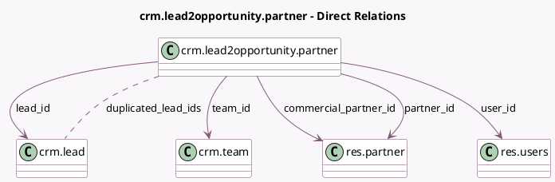

<!-- GENERATED:MODEL -->
---
tags: [odoo, community, generated, model]
---

# crm.lead2opportunity.partner

- Module: [[docs/Community Addons/crm/crm|crm]]
- Scope: Community Addons
- Defined in module: yes
- Source files: `wizard/crm_lead_to_opportunity.py`
- Python classes: `CrmLead2opportunityPartner`
- Description: Convert Lead to Opportunity (not in mass)

## Field footprint

- Detected fields: 11
- Field types: `Boolean` x 1, `Char` x 2, `Many2many` x 1, `Many2one` x 5, `Selection` x 2
- Relation fields: 6

## Sample fields

- `action`: `Selection` (compute `_compute_action`, store `True`)
- `commercial_partner_id`: `Many2one` (comodel `res.partner`, compute `_compute_commercial_partner_id`, store `True`)
- `duplicated_lead_ids`: `Many2many` (comodel `crm.lead`, compute `_compute_duplicated_lead_ids`, store `True`)
- `force_assignment`: `Boolean` (comodel `Force assignment`)
- `lead_contact_name`: `Char` (related `lead_id.contact_name`)
- `lead_id`: `Many2one` (comodel `crm.lead`)
- `lead_partner_name`: `Char` (related `lead_id.partner_name`)
- `name`: `Selection` (compute `_compute_name`, store `True`)
- `partner_id`: `Many2one` (comodel `res.partner`, compute `_compute_partner_id`, store `True`)
- `team_id`: `Many2one` (comodel `crm.team`, compute `_compute_team_id`, store `True`)
- `user_id`: `Many2one` (comodel `res.users`, compute `_compute_user_id`, store `True`)

## Method hints

- Detected methods: 13
- Action methods: `action_apply`
- Compute methods: `_compute_action`, `_compute_commercial_partner_id`, `_compute_duplicated_lead_ids`, `_compute_name`, `_compute_partner_id`, `_compute_team_id`, `_compute_user_id`
- Onchange methods: none

## Direct relation diagram

## Navigation

- **Parent:** [[docs/Community Addons/crm/Models]]

<!-- GENERATED:MODEL -->
