<!-- GENERATED:MODEL -->
---
tags: [odoo, community, generated, model]
---

# crm.merge.opportunity

- Module: [[docs/Community Addons/crm/crm|crm]]
- Scope: Community Addons
- Defined in module: yes
- Source files: `wizard/crm_merge_opportunities.py`
- Python classes: `CrmMergeOpportunity`
- Description: Merge Opportunities

## Field footprint

- Detected fields: 3
- Field types: `Many2many` x 1, `Many2one` x 2
- Relation fields: 3

## Sample fields

- `opportunity_ids`: `Many2many` (comodel `crm.lead`)
- `team_id`: `Many2one` (comodel `crm.team`, compute `_compute_team_id`, store `True`)
- `user_id`: `Many2one` (comodel `res.users`)

## Method hints

- Detected methods: 3
- Action methods: `action_merge`
- Compute methods: `_compute_team_id`
- Onchange methods: none

## Direct relation diagram

```plantuml
@startuml
!define ODOO_COLOR_PRIMARY #714B67
!define ODOO_COLOR_ACCENT #875A7B
!define ODOO_COLOR_BG #FAF7FA

skinparam backgroundColor ODOO_COLOR_BG
skinparam defaultTextAlignment left
skinparam ArrowColor ODOO_COLOR_ACCENT
skinparam ClassBackgroundColor white
skinparam ClassBorderColor ODOO_COLOR_PRIMARY
skinparam ComponentBackgroundColor white
skinparam ComponentBorderColor ODOO_COLOR_PRIMARY
skinparam NoteBackgroundColor #FFF8FF
skinparam NoteBorderColor ODOO_COLOR_ACCENT
skinparam SequenceLifeLineBorderColor ODOO_COLOR_ACCENT
skinparam SequenceLifeLineBackgroundColor #FFFFFF
skinparam SequenceParticipantBorderColor ODOO_COLOR_PRIMARY
skinparam SequenceParticipantBackgroundColor #FFFFFF
skinparam sequence {
  ArrowColor ODOO_COLOR_ACCENT
  ActorBorderColor ODOO_COLOR_PRIMARY
}
title crm.merge.opportunity - Direct Relations
class "crm.merge.opportunity" as crm_merge_opportunity
class "crm.lead" as crm_lead
class "crm.team" as crm_team
class "res.users" as res_users
crm_merge_opportunity .. crm_lead : opportunity_ids
crm_merge_opportunity --> res_users : user_id
crm_merge_opportunity --> crm_team : team_id
@enduml
```

## Navigation

- **Parent:** [[docs/Community Addons/crm/Models]]

<!-- GENERATED:MODEL -->
