<!-- GENERATED:MODEL -->
---
tags: [odoo, community, generated, model]
---

# crm.stage

- Module: [[docs/Community Addons/crm/crm|crm]]
- Scope: Community Addons
- Defined in module: yes
- Source files: `models/crm_stage.py`
- Python classes: `CrmStage`
- Description: CRM Stages

## Field footprint

- Detected fields: 9
- Field types: `Boolean` x 2, `Char` x 1, `Integer` x 4, `Many2many` x 1, `Text` x 1
- Relation fields: 1

## Sample fields

- `color`: `Integer`
- `fold`: `Boolean` (comodel `Folded in Pipeline`)
- `is_won`: `Boolean` (comodel `Is Won Stage?`)
- `name`: `Char` (comodel `Stage Name`)
- `requirements`: `Text` (comodel `Requirements`)
- `rotting_threshold_days`: `Integer` (comodel `Days to rot`)
- `sequence`: `Integer` (comodel `Sequence`)
- `team_count`: `Integer` (comodel `team_count`, compute `_compute_team_count`)
- `team_ids`: `Many2many` (comodel `crm.team`)

## Method hints

- Detected methods: 3
- Action methods: none
- Compute methods: `_compute_team_count`
- Onchange methods: `_onchange_is_won`

## Direct relation diagram

```plantuml
@startuml
!define ODOO_COLOR_PRIMARY #714B67
!define ODOO_COLOR_ACCENT #875A7B
!define ODOO_COLOR_BG #FAF7FA

skinparam backgroundColor ODOO_COLOR_BG
skinparam defaultTextAlignment left
skinparam ArrowColor ODOO_COLOR_ACCENT
skinparam ClassBackgroundColor white
skinparam ClassBorderColor ODOO_COLOR_PRIMARY
skinparam ComponentBackgroundColor white
skinparam ComponentBorderColor ODOO_COLOR_PRIMARY
skinparam NoteBackgroundColor #FFF8FF
skinparam NoteBorderColor ODOO_COLOR_ACCENT
skinparam SequenceLifeLineBorderColor ODOO_COLOR_ACCENT
skinparam SequenceLifeLineBackgroundColor #FFFFFF
skinparam SequenceParticipantBorderColor ODOO_COLOR_PRIMARY
skinparam SequenceParticipantBackgroundColor #FFFFFF
skinparam sequence {
  ArrowColor ODOO_COLOR_ACCENT
  ActorBorderColor ODOO_COLOR_PRIMARY
}
title crm.stage - Direct Relations
class "crm.stage" as crm_stage
class "crm.team" as crm_team
crm_stage .. crm_team : team_ids
@enduml
```

## Navigation

- **Parent:** [[docs/Community Addons/crm/Models]]

<!-- GENERATED:MODEL -->
