<!-- GENERATED:MODEL -->
---
tags: [odoo, community, generated, model]
---

# crm.team

- Module: [[docs/Community Addons/crm/crm|crm]]
- Scope: Community Addons
- Defined in module: yes
- Source files: `models/crm_team.py`
- Python classes: `CrmTeam`
- Description: Sales Team
- Inherits: `mail.alias.mixin`

## Field footprint

- Detected fields: 12
- Field types: `Boolean` x 6, `Char` x 1, `Integer` x 3, `Many2one` x 1, `PropertiesDefinition` x 1
- Relation fields: 1

## Sample fields

- `alias_id`: `Many2one`
- `assignment_auto_enabled`: `Boolean` (comodel `Auto Assignment`, compute `_compute_assignment_enabled`)
- `assignment_domain`: `Char` (comodel `Assignment Domain`)
- `assignment_enabled`: `Boolean` (comodel `Lead Assign`, compute `_compute_assignment_enabled`)
- `assignment_max`: `Integer` (comodel `Lead Average Capacity`, compute `_compute_assignment_max`)
- `assignment_optout`: `Boolean` (comodel `Skip auto assignment`)
- `lead_all_assigned_month_count`: `Integer` (compute `_compute_lead_all_assigned_month_count`)
- `lead_all_assigned_month_exceeded`: `Boolean` (comodel `Exceed monthly lead assignement`, compute `_compute_lead_all_assigned_month_count`)
- `lead_properties_definition`: `PropertiesDefinition` (comodel `Lead Properties`)
- `lead_unassigned_count`: `Integer` (compute `_compute_lead_unassigned_count`)
- `use_leads`: `Boolean` (comodel `Leads`)
- `use_opportunities`: `Boolean` (comodel `Pipeline`)

## Method hints

- Detected methods: 24
- Action methods: `action_assign_leads`, `action_open_leads`, `action_open_unassigned_leads`, `action_opportunity_forecast`, `action_primary_channel_button`, `action_your_pipeline`
- Compute methods: `_compute_assignment_enabled`, `_compute_assignment_max`, `_compute_dashboard_button_name`, `_compute_lead_all_assigned_month_count`, `_compute_lead_unassigned_count`
- Onchange methods: `_onchange_use_leads_opportunities`

## Direct relation diagram

```plantuml
@startuml
!define ODOO_COLOR_PRIMARY #714B67
!define ODOO_COLOR_ACCENT #875A7B
!define ODOO_COLOR_BG #FAF7FA

skinparam backgroundColor ODOO_COLOR_BG
skinparam defaultTextAlignment left
skinparam ArrowColor ODOO_COLOR_ACCENT
skinparam ClassBackgroundColor white
skinparam ClassBorderColor ODOO_COLOR_PRIMARY
skinparam ComponentBackgroundColor white
skinparam ComponentBorderColor ODOO_COLOR_PRIMARY
skinparam NoteBackgroundColor #FFF8FF
skinparam NoteBorderColor ODOO_COLOR_ACCENT
skinparam SequenceLifeLineBorderColor ODOO_COLOR_ACCENT
skinparam SequenceLifeLineBackgroundColor #FFFFFF
skinparam SequenceParticipantBorderColor ODOO_COLOR_PRIMARY
skinparam SequenceParticipantBackgroundColor #FFFFFF
skinparam sequence {
  ArrowColor ODOO_COLOR_ACCENT
  ActorBorderColor ODOO_COLOR_PRIMARY
}
title crm.team - Direct Relations
class "crm.team" as crm_team
@enduml
```

## Navigation

- **Parent:** [[docs/Community Addons/crm/Models]]

<!-- GENERATED:MODEL -->
