<!-- GENERATED:MODEL -->
---
tags: [odoo, community, generated, model]
---

# res.config.settings

- Module: [[docs/Community Addons/crm/crm|crm]]
- Scope: Community Addons
- Defined in module: extension only
- Source files: `models/res_config_settings.py`
- Python classes: `ResConfigSettings`

## Field footprint

- Detected fields: 19
- Field types: `Boolean` x 9, `Char` x 3, `Date` x 1, `Datetime` x 1, `Integer` x 1, `Many2many` x 1, `Selection` x 3
- Relation fields: 1

## Sample fields

- `crm_auto_assignment_action`: `Selection` (compute `_compute_crm_auto_assignment_data`, store `True`)
- `crm_auto_assignment_interval_number`: `Integer` (compute `_compute_crm_auto_assignment_data`, store `True`)
- `crm_auto_assignment_interval_type`: `Selection` (compute `_compute_crm_auto_assignment_data`, store `True`)
- `crm_auto_assignment_run_datetime`: `Datetime` (compute `_compute_crm_auto_assignment_data`, store `True`)
- `crm_use_auto_assignment`: `Boolean`
- `group_use_lead`: `Boolean`
- `group_use_recurring_revenues`: `Boolean`
- `is_membership_multi`: `Boolean`
- `lead_enrich_auto`: `Selection`
- `lead_mining_in_pipeline`: `Boolean` (comodel `Create a lead mining request directly from the opportunity pipeline.`)
- `module_crm_iap_enrich`: `Boolean` (comodel `Enrich your leads automatically with company data based on their email address.`)
- `module_crm_iap_mine`: `Boolean` (comodel `Generate new leads based on their country, industries, size, etc.`)
- `module_partnership`: `Boolean` (comodel `Membership / Partnership`)
- `module_website_crm_iap_reveal`: `Boolean` (comodel `Create Leads/Opportunities from your website's traffic`)
- `predictive_lead_scoring_field_labels`: `Char` (compute `_compute_predictive_lead_scoring_field_labels`)
- `predictive_lead_scoring_fields`: `Many2many` (comodel `crm.lead.scoring.frequency.field`, compute `_compute_pls_fields`)
- `predictive_lead_scoring_fields_str`: `Char`
- `predictive_lead_scoring_start_date`: `Date` (compute `_compute_pls_start_date`)
- `predictive_lead_scoring_start_date_str`: `Char`

## Method hints

- Detected methods: 10
- Action methods: `action_crm_assign_leads`
- Compute methods: `_compute_crm_auto_assignment_data`, `_compute_pls_fields`, `_compute_pls_start_date`, `_compute_predictive_lead_scoring_field_labels`
- Onchange methods: `_onchange_crm_auto_assignment_run_datetime`

## Direct relation diagram

```plantuml
@startuml
!define ODOO_COLOR_PRIMARY #714B67
!define ODOO_COLOR_ACCENT #875A7B
!define ODOO_COLOR_BG #FAF7FA

skinparam backgroundColor ODOO_COLOR_BG
skinparam defaultTextAlignment left
skinparam ArrowColor ODOO_COLOR_ACCENT
skinparam ClassBackgroundColor white
skinparam ClassBorderColor ODOO_COLOR_PRIMARY
skinparam ComponentBackgroundColor white
skinparam ComponentBorderColor ODOO_COLOR_PRIMARY
skinparam NoteBackgroundColor #FFF8FF
skinparam NoteBorderColor ODOO_COLOR_ACCENT
skinparam SequenceLifeLineBorderColor ODOO_COLOR_ACCENT
skinparam SequenceLifeLineBackgroundColor #FFFFFF
skinparam SequenceParticipantBorderColor ODOO_COLOR_PRIMARY
skinparam SequenceParticipantBackgroundColor #FFFFFF
skinparam sequence {
  ArrowColor ODOO_COLOR_ACCENT
  ActorBorderColor ODOO_COLOR_PRIMARY
}
title res.config.settings - Direct Relations
class "res.config.settings" as res_config_settings
class "crm.lead.scoring.frequency.field" as crm_lead_scoring_frequency_field
res_config_settings .. crm_lead_scoring_frequency_field : predictive_lead_scoring_fields
@enduml
```

## Navigation

- **Parent:** [[docs/Community Addons/crm/Models]]

<!-- GENERATED:MODEL -->
