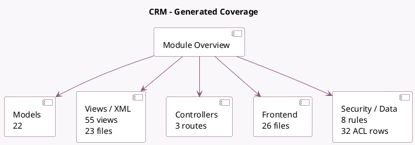

<!-- GENERATED:MODULE -->
---
tags: [odoo, community, module]
---

# CRM

- Scope: Community Addons
- Source: odoo/addons/crm
- Dependencies: [[docs/Community Addons/base_setup/base_setup|base_setup]], [[docs/Community Addons/sales_team/sales_team|sales_team]], [[docs/Community Addons/mail/mail|mail]], [[docs/Community Addons/calendar/calendar|calendar]], [[docs/Community Addons/resource/resource|resource]], [[docs/Community Addons/utm/utm|utm]], [[docs/Community Addons/web_tour/web_tour|web_tour]], [[docs/Community Addons/contacts/contacts|contacts]], [[docs/Community Addons/digest/digest|digest]], [[docs/Community Addons/phone_validation/phone_validation|phone_validation]]

## Summary

Track leads and close opportunities

## Generated coverage

- Models: 22
- XML files with UI/data artifacts: 23
- Views: 55
- Actions: 60
- Menus: 27
- Rules (ir.rule): 8
- Access CSV entries: 32
- Controller units: 1
- Frontend asset files: 26

## Module map

## Detail notes

- Models: [[docs/Community Addons/crm/Models|Models]] (22)
- Views and XML: [[docs/Community Addons/crm/Views|Views]] (23 files)
- Controllers: [[docs/Community Addons/crm/Controllers|Controllers]] (1)
- Frontend: [[docs/Community Addons/crm/Frontend|Frontend]] (26 files)

## Key models

- `calendar.event`
- `crm.activity.report`
- `crm.lead`
- `crm.lead.lost`
- `crm.lead.pls.update`
- `crm.lead.scoring.frequency`
- `crm.lead.scoring.frequency.field`
- `crm.lead2opportunity.partner`
- `crm.lead2opportunity.partner.mass`
- `crm.lost.reason`
- `crm.merge.opportunity`
- `crm.recurring.plan`

## Navigation

- [[../Community Addons/Community Addons|Back to scope]]
- [[../../docs/docs|Back to docs]]

<!-- GENERATED:MODULE -->

