<!-- GENERATED:MODEL -->
---
tags: [odoo, community, generated, model]
---

# crm.iap.lead.mining.request

- Module: [[docs/Community Addons/crm_iap_mine/crm_iap_mine|crm_iap_mine]]
- Scope: Community Addons
- Defined in module: yes
- Source files: `models/crm_iap_lead_mining_request.py`
- Python classes: `CrmIapLeadMiningRequest`
- Description: CRM Lead Mining Request

## Field footprint

- Detected fields: 26
- Field types: `Boolean` x 1, `Char` x 4, `Integer` x 5, `Many2many` x 5, `Many2one` x 4, `One2many` x 2, `Selection` x 5
- Relation fields: 11

## Sample fields

- `available_state_ids`: `One2many` (comodel `res.country.state`, compute `_compute_available_state_ids`)
- `company_size_max`: `Integer`
- `company_size_min`: `Integer`
- `contact_filter_type`: `Selection`
- `contact_number`: `Integer`
- `country_ids`: `Many2many` (comodel `res.country`)
- `error_type`: `Selection`
- `filter_on_size`: `Boolean`
- `industry_ids`: `Many2many` (comodel `crm.iap.lead.industry`)
- `lead_contacts_credits`: `Char` (compute `_compute_tooltip`)
- `lead_count`: `Integer` (compute `_compute_lead_count`)
- `lead_credits`: `Char` (compute `_compute_tooltip`)
- `lead_ids`: `One2many` (comodel `crm.lead`)
- `lead_number`: `Integer`
- `lead_total_credits`: `Char` (compute `_compute_tooltip`)
- `lead_type`: `Selection`
- `name`: `Char`
- `preferred_role_id`: `Many2one` (comodel `crm.iap.lead.role`)
- `role_ids`: `Many2many` (comodel `crm.iap.lead.role`)
- `search_type`: `Selection`

## Method hints

- Detected methods: 23
- Action methods: `action_buy_credits`, `action_draft`, `action_get_lead_action`, `action_get_opportunity_action`, `action_submit`
- Compute methods: `_compute_available_state_ids`, `_compute_lead_count`, `_compute_team_id`, `_compute_tooltip`
- Onchange methods: `_compute_tooltip`, `_onchange_available_state_ids`, `_onchange_company_size_max`, `_onchange_company_size_min`, `_onchange_contact_number`, `_onchange_country_ids`, `_onchange_lead_number`

## Direct relation diagram

```plantuml
@startuml
!define ODOO_COLOR_PRIMARY #714B67
!define ODOO_COLOR_ACCENT #875A7B
!define ODOO_COLOR_BG #FAF7FA

skinparam backgroundColor ODOO_COLOR_BG
skinparam defaultTextAlignment left
skinparam ArrowColor ODOO_COLOR_ACCENT
skinparam ClassBackgroundColor white
skinparam ClassBorderColor ODOO_COLOR_PRIMARY
skinparam ComponentBackgroundColor white
skinparam ComponentBorderColor ODOO_COLOR_PRIMARY
skinparam NoteBackgroundColor #FFF8FF
skinparam NoteBorderColor ODOO_COLOR_ACCENT
skinparam SequenceLifeLineBorderColor ODOO_COLOR_ACCENT
skinparam SequenceLifeLineBackgroundColor #FFFFFF
skinparam SequenceParticipantBorderColor ODOO_COLOR_PRIMARY
skinparam SequenceParticipantBackgroundColor #FFFFFF
skinparam sequence {
  ArrowColor ODOO_COLOR_ACCENT
  ActorBorderColor ODOO_COLOR_PRIMARY
}
title crm.iap.lead.mining.request - Direct Relations
class "crm.iap.lead.mining.request" as crm_iap_lead_mining_request
class "crm.iap.lead.industry" as crm_iap_lead_industry
class "crm.iap.lead.role" as crm_iap_lead_role
class "crm.iap.lead.seniority" as crm_iap_lead_seniority
class "crm.lead" as crm_lead
class "crm.tag" as crm_tag
class "crm.team" as crm_team
class "res.country" as res_country
class "res.country.state" as res_country_state
class "res.users" as res_users
crm_iap_lead_mining_request --> crm_team : team_id
crm_iap_lead_mining_request --> res_users : user_id
crm_iap_lead_mining_request .. crm_tag : tag_ids
crm_iap_lead_mining_request --|> crm_lead : lead_ids
crm_iap_lead_mining_request .. res_country : country_ids
crm_iap_lead_mining_request .. res_country_state : state_ids
crm_iap_lead_mining_request --|> res_country_state : available_state_ids
crm_iap_lead_mining_request .. crm_iap_lead_industry : industry_ids
crm_iap_lead_mining_request --> crm_iap_lead_role : preferred_role_id
crm_iap_lead_mining_request .. crm_iap_lead_role : role_ids
crm_iap_lead_mining_request --> crm_iap_lead_seniority : seniority_id
@enduml
```

## Navigation

- **Parent:** [[docs/Community Addons/crm_iap_mine/Models]]

<!-- GENERATED:MODEL -->
