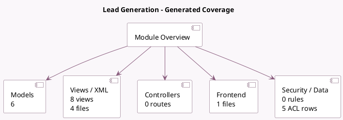

<!-- GENERATED:MODULE -->
---
tags: [odoo, community, module]
---

# Lead Generation

- Scope: Community Addons
- Source: odoo/addons/crm_iap_mine
- Dependencies: [[docs/Community Addons/iap_crm/iap_crm|iap_crm]], [[docs/Community Addons/iap_mail/iap_mail|iap_mail]]

## Summary

Generate Leads/Opportunities based on country, industries, size, etc.

## Generated coverage

- Models: 6
- XML files with UI/data artifacts: 4
- Views: 8
- Actions: 1
- Menus: 2
- Rules (ir.rule): 0
- Access CSV entries: 5
- Controller units: 0
- Frontend asset files: 1

## Module map

## Detail notes

- Models: [[docs/Community Addons/crm_iap_mine/Models|Models]] (6)
- Views and XML: [[docs/Community Addons/crm_iap_mine/Views|Views]] (4 files)
- Frontend: [[docs/Community Addons/crm_iap_mine/Frontend|Frontend]] (1 files)

## Key models

- `crm.iap.lead.helpers`
- `crm.iap.lead.industry`
- `crm.iap.lead.mining.request`
- `crm.iap.lead.role`
- `crm.iap.lead.seniority`
- `crm.lead`

## Navigation

- [[../Community Addons/Community Addons|Back to scope]]
- [[../../docs/docs|Back to docs]]

<!-- GENERATED:MODULE -->

