<!-- GENERATED:MODEL -->
---
tags: [odoo, community, generated, model]
---

# chatbot.script.step

- Module: [[docs/Community Addons/crm_livechat/crm_livechat|crm_livechat]]
- Scope: Community Addons
- Defined in module: extension only
- Source files: `models/chatbot_script_step.py`
- Python classes: `ChatbotScriptStep`

## Field footprint

- Detected fields: 2
- Field types: `Many2one` x 1, `Selection` x 1
- Relation fields: 1

## Sample fields

- `crm_team_id`: `Many2one` (comodel `crm.team`)
- `step_type`: `Selection`

## Method hints

- Detected methods: 5
- Action methods: none
- Compute methods: `_compute_is_forward_operator`
- Onchange methods: none

## Direct relation diagram

```plantuml
@startuml
!define ODOO_COLOR_PRIMARY #714B67
!define ODOO_COLOR_ACCENT #875A7B
!define ODOO_COLOR_BG #FAF7FA

skinparam backgroundColor ODOO_COLOR_BG
skinparam defaultTextAlignment left
skinparam ArrowColor ODOO_COLOR_ACCENT
skinparam ClassBackgroundColor white
skinparam ClassBorderColor ODOO_COLOR_PRIMARY
skinparam ComponentBackgroundColor white
skinparam ComponentBorderColor ODOO_COLOR_PRIMARY
skinparam NoteBackgroundColor #FFF8FF
skinparam NoteBorderColor ODOO_COLOR_ACCENT
skinparam SequenceLifeLineBorderColor ODOO_COLOR_ACCENT
skinparam SequenceLifeLineBackgroundColor #FFFFFF
skinparam SequenceParticipantBorderColor ODOO_COLOR_PRIMARY
skinparam SequenceParticipantBackgroundColor #FFFFFF
skinparam sequence {
  ArrowColor ODOO_COLOR_ACCENT
  ActorBorderColor ODOO_COLOR_PRIMARY
}
title chatbot.script.step - Direct Relations
class "chatbot.script.step" as chatbot_script_step
class "crm.team" as crm_team
chatbot_script_step --> crm_team : crm_team_id
@enduml
```

## Navigation

- **Parent:** [[docs/Community Addons/crm_livechat/Models]]

<!-- GENERATED:MODEL -->
