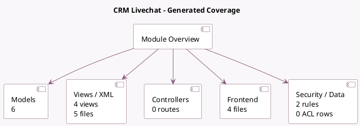

<!-- GENERATED:MODULE -->
---
tags: [odoo, community, module]
---

# CRM Livechat

- Scope: Community Addons
- Source: odoo/addons/crm_livechat
- Dependencies: [[docs/Community Addons/crm/crm|crm]], [[docs/Community Addons/im_livechat/im_livechat|im_livechat]]

## Summary

Create lead from livechat conversation

## Generated coverage

- Models: 6
- XML files with UI/data artifacts: 5
- Views: 4
- Actions: 0
- Menus: 0
- Rules (ir.rule): 2
- Access CSV entries: 0
- Controller units: 0
- Frontend asset files: 4

## Module map

## Detail notes

- Models: [[docs/Community Addons/crm_livechat/Models|Models]] (6)
- Views and XML: [[docs/Community Addons/crm_livechat/Views|Views]] (5 files)
- Frontend: [[docs/Community Addons/crm_livechat/Frontend|Frontend]] (4 files)

## Key models

- `chatbot.script`
- `chatbot.script.step`
- `crm.lead`
- `discuss.channel`
- `im_livechat.report.channel`
- `res.users`

## Navigation

- [[../Community Addons/Community Addons|Back to scope]]
- [[../../docs/docs|Back to docs]]

<!-- GENERATED:MODULE -->

