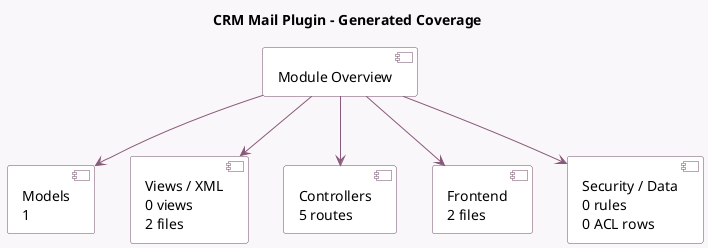

<!-- GENERATED:MODULE -->
---
tags: [odoo, community, module]
---

# CRM Mail Plugin

- Scope: Community Addons
- Source: odoo/addons/crm_mail_plugin
- Dependencies: [[docs/Community Addons/crm/crm|crm]], [[docs/Community Addons/mail_plugin/mail_plugin|mail_plugin]]

## Summary

Turn emails received in your mailbox into leads and log their content as internal notes.

## Generated coverage

- Models: 1
- XML files with UI/data artifacts: 2
- Views: 0
- Actions: 2
- Menus: 0
- Rules (ir.rule): 0
- Access CSV entries: 0
- Controller units: 1
- Frontend asset files: 2

## Module map

## Detail notes

- Models: [[docs/Community Addons/crm_mail_plugin/Models|Models]] (1)
- Views and XML: [[docs/Community Addons/crm_mail_plugin/Views|Views]] (2 files)
- Controllers: [[docs/Community Addons/crm_mail_plugin/Controllers|Controllers]] (1)
- Frontend: [[docs/Community Addons/crm_mail_plugin/Frontend|Frontend]] (2 files)

## Key models

- `crm.lead`

## Navigation

- [[../Community Addons/Community Addons|Back to scope]]
- [[../../docs/docs|Back to docs]]

<!-- GENERATED:MODULE -->

