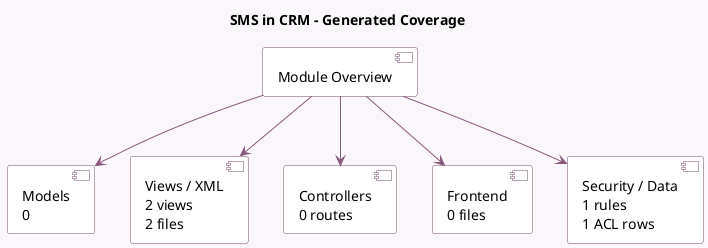

<!-- GENERATED:MODULE -->
---
tags: [odoo, community, module]
---

# SMS in CRM

- Scope: Community Addons
- Source: odoo/addons/crm_sms
- Dependencies: [[docs/Community Addons/crm/crm|crm]], [[docs/Community Addons/sms/sms|sms]]

## Summary

Add SMS capabilities to CRM

## Generated coverage

- Models: 0
- XML files with UI/data artifacts: 2
- Views: 2
- Actions: 2
- Menus: 0
- Rules (ir.rule): 1
- Access CSV entries: 1
- Controller units: 0
- Frontend asset files: 0

## Module map

## Detail notes

- Views and XML: [[docs/Community Addons/crm_sms/Views|Views]] (2 files)

## Navigation

- [[../Community Addons/Community Addons|Back to scope]]
- [[../../docs/docs|Back to docs]]

<!-- GENERATED:MODULE -->

