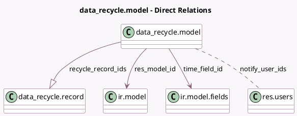

<!-- GENERATED:MODEL -->
---
tags: [odoo, community, generated, model]
---

# data_recycle.model

- Module: [[docs/Community Addons/data_recycle/data_recycle|data_recycle]]
- Scope: Community Addons
- Defined in module: yes
- Source files: `models/data_recycle_model.py`
- Python classes: `Data_RecycleModel`
- Description: Recycling Model

## Field footprint

- Detected fields: 17
- Field types: `Boolean` x 2, `Char` x 3, `Datetime` x 1, `Integer` x 3, `Many2many` x 1, `Many2one` x 2, `One2many` x 1, `Selection` x 4
- Relation fields: 4

## Sample fields

- `active`: `Boolean`
- `domain`: `Char` (compute `_compute_domain`, store `True`)
- `include_archived`: `Boolean`
- `last_notification`: `Datetime`
- `name`: `Char` (compute `_compute_name`, store `True`)
- `notify_frequency`: `Integer`
- `notify_frequency_period`: `Selection`
- `notify_user_ids`: `Many2many` (comodel `res.users`)
- `records_to_recycle_count`: `Integer` (comodel `Records To Recycle`, compute `_compute_records_to_recycle_count`)
- `recycle_action`: `Selection`
- `recycle_mode`: `Selection`
- `recycle_record_ids`: `One2many` (comodel `data_recycle.record`)
- `res_model_id`: `Many2one` (comodel `ir.model`)
- `res_model_name`: `Char` (related `res_model_id.model`, store `True`)
- `time_field_delta`: `Integer`
- `time_field_delta_unit`: `Selection`
- `time_field_id`: `Many2one` (comodel `ir.model.fields`)

## Method hints

- Detected methods: 11
- Action methods: `action_recycle_records`
- Compute methods: `_compute_domain`, `_compute_name`, `_compute_records_to_recycle_count`
- Onchange methods: none

## Direct relation diagram

## Navigation

- **Parent:** [[docs/Community Addons/data_recycle/Models]]

<!-- GENERATED:MODEL -->
