<!-- GENERATED:MODEL -->
---
tags: [odoo, community, generated, model]
---

# data_recycle.record

- Module: [[docs/Community Addons/data_recycle/data_recycle|data_recycle]]
- Scope: Community Addons
- Defined in module: yes
- Source files: `models/data_recycle_record.py`
- Python classes: `Data_RecycleRecord`
- Description: Recycling Record

## Field footprint

- Detected fields: 7
- Field types: `Boolean` x 1, `Char` x 2, `Integer` x 1, `Many2one` x 3
- Relation fields: 3

## Sample fields

- `active`: `Boolean` (comodel `Active`)
- `company_id`: `Many2one` (comodel `res.company`, compute `_compute_company_id`, store `True`)
- `name`: `Char` (comodel `Record Name`, compute `_compute_name`)
- `recycle_model_id`: `Many2one` (comodel `data_recycle.model`)
- `res_id`: `Integer` (comodel `Record ID`)
- `res_model_id`: `Many2one` (related `recycle_model_id.res_model_id`, store `True`)
- `res_model_name`: `Char` (related `recycle_model_id.res_model_name`, store `True`)

## Method hints

- Detected methods: 6
- Action methods: `action_discard`, `action_validate`
- Compute methods: `_compute_company_id`, `_compute_name`
- Onchange methods: none

## Direct relation diagram

```plantuml
@startuml
!define ODOO_COLOR_PRIMARY #714B67
!define ODOO_COLOR_ACCENT #875A7B
!define ODOO_COLOR_BG #FAF7FA

skinparam backgroundColor ODOO_COLOR_BG
skinparam defaultTextAlignment left
skinparam ArrowColor ODOO_COLOR_ACCENT
skinparam ClassBackgroundColor white
skinparam ClassBorderColor ODOO_COLOR_PRIMARY
skinparam ComponentBackgroundColor white
skinparam ComponentBorderColor ODOO_COLOR_PRIMARY
skinparam NoteBackgroundColor #FFF8FF
skinparam NoteBorderColor ODOO_COLOR_ACCENT
skinparam SequenceLifeLineBorderColor ODOO_COLOR_ACCENT
skinparam SequenceLifeLineBackgroundColor #FFFFFF
skinparam SequenceParticipantBorderColor ODOO_COLOR_PRIMARY
skinparam SequenceParticipantBackgroundColor #FFFFFF
skinparam sequence {
  ArrowColor ODOO_COLOR_ACCENT
  ActorBorderColor ODOO_COLOR_PRIMARY
}
title data_recycle.record - Direct Relations
class "data_recycle.record" as data_recycle_record
class "data_recycle.model" as data_recycle_model
class "res.company" as res_company
data_recycle_record --> data_recycle_model : recycle_model_id
data_recycle_record --> res_company : company_id
@enduml
```

## Navigation

- **Parent:** [[docs/Community Addons/data_recycle/Models]]

<!-- GENERATED:MODEL -->
