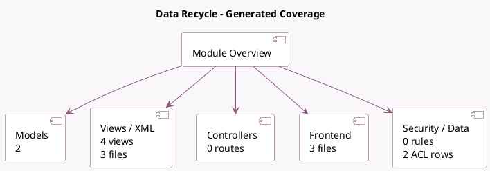

<!-- GENERATED:MODULE -->
---
tags: [odoo, community, module]
---

# Data Recycle

- Scope: Community Addons
- Source: odoo/addons/data_recycle
- Dependencies: [[docs/Community Addons/mail/mail|mail]]

## Summary

Find old records and archive/delete them

## Generated coverage

- Models: 2
- XML files with UI/data artifacts: 3
- Views: 4
- Actions: 3
- Menus: 5
- Rules (ir.rule): 0
- Access CSV entries: 2
- Controller units: 0
- Frontend asset files: 3

## Module map

## Detail notes

- Models: [[docs/Community Addons/data_recycle/Models|Models]] (2)
- Views and XML: [[docs/Community Addons/data_recycle/Views|Views]] (3 files)
- Frontend: [[docs/Community Addons/data_recycle/Frontend|Frontend]] (3 files)

## Key models

- `data_recycle.model`
- `data_recycle.record`

## Navigation

- [[../Community Addons/Community Addons|Back to scope]]
- [[../../docs/docs|Back to docs]]

<!-- GENERATED:MODULE -->

