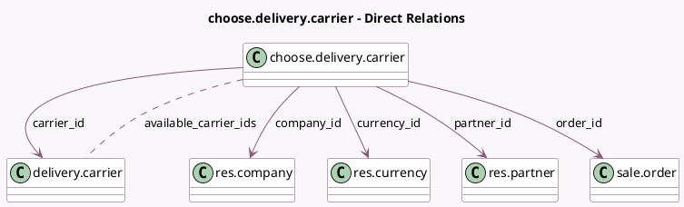

<!-- GENERATED:MODEL -->
---
tags: [odoo, community, generated, model]
---

# choose.delivery.carrier

- Module: [[docs/Community Addons/delivery/delivery|delivery]]
- Scope: Community Addons
- Defined in module: yes
- Source files: `wizard/choose_delivery_carrier.py`
- Python classes: `ChooseDeliveryCarrier`
- Description: Delivery Carrier Selection Wizard

## Field footprint

- Detected fields: 13
- Field types: `Char` x 1, `Float` x 3, `Many2many` x 1, `Many2one` x 5, `Selection` x 1, `Text` x 2
- Relation fields: 6

## Sample fields

- `available_carrier_ids`: `Many2many` (comodel `delivery.carrier`, compute `_compute_available_carrier`)
- `carrier_id`: `Many2one` (comodel `delivery.carrier`)
- `company_id`: `Many2one` (comodel `res.company`, related `order_id.company_id`)
- `currency_id`: `Many2one` (comodel `res.currency`, related `order_id.currency_id`)
- `delivery_message`: `Text`
- `delivery_price`: `Float`
- `delivery_type`: `Selection` (related `carrier_id.delivery_type`)
- `display_price`: `Float`
- `invoicing_message`: `Text` (compute `_compute_invoicing_message`)
- `order_id`: `Many2one` (comodel `sale.order`)
- `partner_id`: `Many2one` (comodel `res.partner`, related `order_id.partner_id`)
- `total_weight`: `Float` (related `order_id.shipping_weight`)
- `weight_uom_name`: `Char`

## Method hints

- Detected methods: 8
- Action methods: none
- Compute methods: `_compute_available_carrier`, `_compute_invoicing_message`
- Onchange methods: `_onchange_carrier_id`, `_onchange_order_id`

## Direct relation diagram

## Navigation

- **Parent:** [[docs/Community Addons/delivery/Models]]

<!-- GENERATED:MODEL -->
