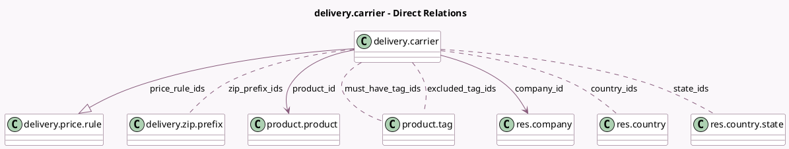

<!-- GENERATED:MODEL -->
---
tags: [odoo, community, generated, model]
---

# delivery.carrier

- Module: [[docs/Community Addons/delivery/delivery|delivery]]
- Scope: Community Addons
- Defined in module: yes
- Source files: `models/delivery_carrier.py`
- Python classes: `DeliveryCarrier`
- Description: Shipping Methods

## Field footprint

- Detected fields: 34
- Field types: `Boolean` x 9, `Char` x 4, `Float` x 6, `Integer` x 2, `Many2many` x 5, `Many2one` x 3, `One2many` x 1, `Selection` x 3, `Text` x 1
- Relation fields: 9

## Sample fields

- `active`: `Boolean`
- `allow_cash_on_delivery`: `Boolean`
- `amount`: `Float`
- `can_generate_return`: `Boolean` (compute `_compute_can_generate_return`)
- `carrier_description`: `Text` (comodel `Carrier Description`)
- `company_id`: `Many2one` (comodel `res.company`, related `product_id.company_id`, store `True`)
- `country_ids`: `Many2many` (comodel `res.country`)
- `currency_id`: `Many2one` (related `product_id.currency_id`)
- `debug_logging`: `Boolean` (comodel `Debug logging`)
- `delivery_type`: `Selection`
- `excluded_tag_ids`: `Many2many` (comodel `product.tag`)
- `fixed_margin`: `Float`
- `fixed_price`: `Float` (compute `_compute_fixed_price`, store `True`)
- `free_over`: `Boolean` (comodel `Free if order amount is above`)
- `get_return_label_from_portal`: `Boolean`
- `integration_level`: `Selection`
- `invoice_policy`: `Selection`
- `margin`: `Float`
- `max_volume`: `Float` (comodel `Max Volume`)
- `max_weight`: `Float` (comodel `Max Weight`)

## Method hints

- Detected methods: 34
- Action methods: none
- Compute methods: `_compute_can_generate_return`, `_compute_currency`, `_compute_fixed_price`, `_compute_supports_shipping_insurance`, `_compute_volume_uom_name`, `_compute_weight_uom_name`
- Onchange methods: `_onchange_can_generate_return`, `_onchange_country_ids`, `_onchange_integration_level`, `_onchange_return_label_on_delivery`

## Direct relation diagram

## Navigation

- **Parent:** [[docs/Community Addons/delivery/Models]]

<!-- GENERATED:MODEL -->
