<!-- GENERATED:MODEL -->
---
tags: [odoo, community, generated, model]
---

# delivery.price.rule

- Module: [[docs/Community Addons/delivery/delivery|delivery]]
- Scope: Community Addons
- Defined in module: yes
- Source files: `models/delivery_price_rule.py`
- Python classes: `DeliveryPriceRule`
- Description: Delivery Price Rules

## Field footprint

- Detected fields: 10
- Field types: `Char` x 1, `Float` x 3, `Integer` x 1, `Many2one` x 2, `Selection` x 3
- Relation fields: 2

## Sample fields

- `carrier_id`: `Many2one` (comodel `delivery.carrier`)
- `currency_id`: `Many2one` (related `carrier_id.currency_id`)
- `list_base_price`: `Float`
- `list_price`: `Float` (comodel `Sale Price`)
- `max_value`: `Float` (comodel `Maximum Value`)
- `name`: `Char` (compute `_compute_name`)
- `operator`: `Selection`
- `sequence`: `Integer`
- `variable`: `Selection`
- `variable_factor`: `Selection`

## Method hints

- Detected methods: 1
- Action methods: none
- Compute methods: `_compute_name`
- Onchange methods: none

## Direct relation diagram

```plantuml
@startuml
!define ODOO_COLOR_PRIMARY #714B67
!define ODOO_COLOR_ACCENT #875A7B
!define ODOO_COLOR_BG #FAF7FA

skinparam backgroundColor ODOO_COLOR_BG
skinparam defaultTextAlignment left
skinparam ArrowColor ODOO_COLOR_ACCENT
skinparam ClassBackgroundColor white
skinparam ClassBorderColor ODOO_COLOR_PRIMARY
skinparam ComponentBackgroundColor white
skinparam ComponentBorderColor ODOO_COLOR_PRIMARY
skinparam NoteBackgroundColor #FFF8FF
skinparam NoteBorderColor ODOO_COLOR_ACCENT
skinparam SequenceLifeLineBorderColor ODOO_COLOR_ACCENT
skinparam SequenceLifeLineBackgroundColor #FFFFFF
skinparam SequenceParticipantBorderColor ODOO_COLOR_PRIMARY
skinparam SequenceParticipantBackgroundColor #FFFFFF
skinparam sequence {
  ArrowColor ODOO_COLOR_ACCENT
  ActorBorderColor ODOO_COLOR_PRIMARY
}
title delivery.price.rule - Direct Relations
class "delivery.price.rule" as delivery_price_rule
class "delivery.carrier" as delivery_carrier
delivery_price_rule --> delivery_carrier : carrier_id
@enduml
```

## Navigation

- **Parent:** [[docs/Community Addons/delivery/Models]]

<!-- GENERATED:MODEL -->
