<!-- GENERATED:MODEL -->
---
tags: [odoo, community, generated, model]
---

# sale.order

- Module: [[docs/Community Addons/delivery/delivery|delivery]]
- Scope: Community Addons
- Defined in module: extension only
- Source files: `models/sale_order.py`
- Python classes: `SaleOrder`

## Field footprint

- Detected fields: 7
- Field types: `Boolean` x 3, `Char` x 1, `Float` x 1, `Json` x 1, `Many2one` x 1
- Relation fields: 1

## Sample fields

- `carrier_id`: `Many2one` (comodel `delivery.carrier`)
- `delivery_message`: `Char`
- `delivery_set`: `Boolean` (compute `_compute_delivery_state`)
- `is_all_service`: `Boolean` (comodel `Service Product`, compute `_compute_is_service_products`)
- `pickup_location_data`: `Json`
- `recompute_delivery_price`: `Boolean` (comodel `Delivery cost should be recomputed`)
- `shipping_weight`: `Float` (comodel `Shipping Weight`, compute `_compute_shipping_weight`, store `True`)

## Method hints

- Detected methods: 17
- Action methods: `action_open_delivery_wizard`
- Compute methods: `_compute_amount_total_without_delivery`, `_compute_delivery_state`, `_compute_is_service_products`, `_compute_partner_shipping_id`, `_compute_shipping_weight`
- Onchange methods: `onchange_order_line`

## Direct relation diagram

```plantuml
@startuml
!define ODOO_COLOR_PRIMARY #714B67
!define ODOO_COLOR_ACCENT #875A7B
!define ODOO_COLOR_BG #FAF7FA

skinparam backgroundColor ODOO_COLOR_BG
skinparam defaultTextAlignment left
skinparam ArrowColor ODOO_COLOR_ACCENT
skinparam ClassBackgroundColor white
skinparam ClassBorderColor ODOO_COLOR_PRIMARY
skinparam ComponentBackgroundColor white
skinparam ComponentBorderColor ODOO_COLOR_PRIMARY
skinparam NoteBackgroundColor #FFF8FF
skinparam NoteBorderColor ODOO_COLOR_ACCENT
skinparam SequenceLifeLineBorderColor ODOO_COLOR_ACCENT
skinparam SequenceLifeLineBackgroundColor #FFFFFF
skinparam SequenceParticipantBorderColor ODOO_COLOR_PRIMARY
skinparam SequenceParticipantBackgroundColor #FFFFFF
skinparam sequence {
  ArrowColor ODOO_COLOR_ACCENT
  ActorBorderColor ODOO_COLOR_PRIMARY
}
title sale.order - Direct Relations
class "sale.order" as sale_order
class "delivery.carrier" as delivery_carrier
sale_order --> delivery_carrier : carrier_id
@enduml
```

## Navigation

- **Parent:** [[docs/Community Addons/delivery/Models]]

<!-- GENERATED:MODEL -->
